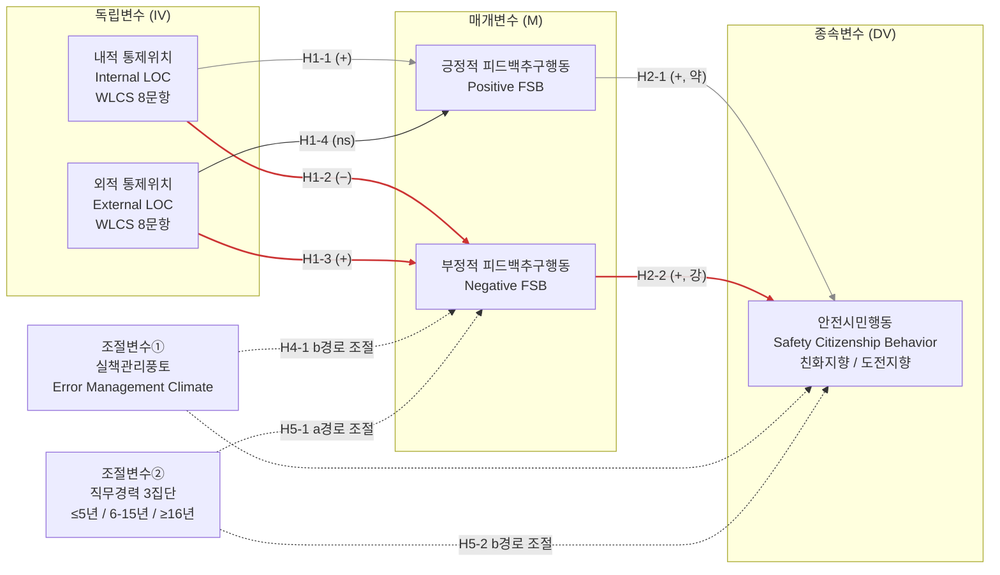

# 01. 연구모형과 가설

**논문 가제**: 소방공무원의 통제위치가 안전시민행동에 미치는 영향 — 피드백추구행동의 매개효과와 실책관리풍토·직무경력의 조절효과

> **문서 위상**: 본 문서는 척도 원전 감사(scale audit) 4건과 이론 조사(theory thread) 3건의 검증 결과를 통합하여 작성된 **연구모형·가설 확정안**이다.
> `docs/_확정사항.md`(교수님 검토 완료 사항)와 충돌할 경우 `_확정사항.md`가 우선하며, 본 문서에서 그와 다른 제안을 하는 부분은 모두 **[변경 제안]** 으로 명시하였다.
> 인용 문헌은 모두 Crossref API 또는 원문 PDF로 실재를 확인한 것이며, 검증 수준을 `[검증됨]` / `[부분검증]` / `[미검증]` 태그로 표기하였다. **태그가 없는 문헌을 본문에 인용하지 말 것.**

---

## 1. 연구모형

### 1.1 모형 도식 (Mermaid)



> 붉은 굵은 선(H1-2, H1-3, H2-2)이 본 연구의 **반론 서사(counter-narrative)** 를 구성하는 핵심 경로이다.

### 1.2 모형 도식 (텍스트 표현)

```
                          [조절①] 실책관리풍토 (연속형)
                          [조절②] 직무경력 (≤5 / 6-15 / ≥16년)
                                        │
                                        │ (b경로 조절)
                                        ▼
  내적 통제위치 ──H1-1(+)──▶ 긍정적 피드백추구 ──H2-1(+,약)──┐
       │                                                      │
       └──H1-2(−)──┐                                          ├──▶ 안전시민행동
                   ├──▶ 부정적 피드백추구 ──H2-2(+,강)────────┘
  외적 통제위치 ──H1-3(+)──┘         ▲
       │                              │ (a경로 조절)
       └──H1-4(ns)──▶ 긍정적 피드백추구  [조절②] 직무경력

  ── 매개: H3 계열 (내적: 부적 간접효과 / 외적: 정적 간접효과)
  ── 조절된 매개: H4-3·H4-4 (실책관리풍토) / H5-3 (직무경력)
  ── 탐색적: H1-5 (내적통제의 역U자 곡선효과), H2-3 (SCB 하위차원 차등)
```

### 1.3 모형의 서술적 진술

본 연구모형은 **"성향(trait) → 자기조절 행동(behavior) → 맥락적 성과(contextual performance)"** 의 3단 구조에 두 개의 조건부 층위를 얹은 **조절된 매개(moderated mediation) 모형**이다. 이론적 우산은 특성활성화이론(Trait Activation Theory; Tett & Burnett, 2003)[검증됨]으로, 특성은 ① 특성 관련 상황단서(trait-relevant cues)가 존재하고 ② 그 행동이 조직에서 보상될 때(reward relevance)에만 가치 있는 성과로 전환된다는 명제를 채택한다. 이 틀에서 통제위치는 특성, 피드백추구행동은 특성 발현 행동, 실책관리풍토는 조직 수준 상황단서이자 보상관련성 함수, 안전시민행동은 가치 있는 성과에 대응한다.

핵심 주장은 **"내적 통제위치가 항상 안전에 유리한 것은 아니다"** 이며, 이를 두 가지 방식으로 검증한다. (1) **매개 수준**: 내적통제는 긍정적 피드백추구를 높이되 부정적(교정적) 피드백추구는 억제하여, 팀 지향적 안전시민행동으로 가는 경로에서 오히려 불리할 수 있다. (2) **조건 수준**: 외적통제 소방공무원의 부정적 피드백추구가 안전시민행동으로 결실을 맺는지는 실책관리풍토라는 조직 조건에 달려 있다.

---

## 2. 변수 및 측정도구 요약

| 구분 | 변수 | 원척도 | 하위차원 | 본 연구 문항 | 응답형식 | 핵심 쟁점 |
|---|---|---|---|---|---|---|
| IV | 통제위치 | Work Locus of Control Scale (Spector, 1988)[검증됨] | 내적 / 외적 | 8 + 8 = 16 | **6점 권고**(현행 5점) | 원척도는 단일차원 총점 → 2변수 분리의 정당화 필요 |
| M | 피드백추구행동 | Ashford & Tsui (1991)[미검증 — KCI 원문 확인 필요] 개념틀 | 긍정 / 부정 | 5 + 5 = 10 | 5점 동의형 | 원전은 4문항·타인평정 → **김어림·한태영(2018)[미검증 — KCI 원문 확인 필요] 14문항으로 교체 권고** |
| Mod① | 실책관리풍토 | van Dyck, Frese, Baer & Sonnentag (2005)[검증됨] | 단일(4 facet) | 8 (원척도 17) | 5점(원척도와 동일) | 8문항 중 4문항이 별개 요인(EAC) 혼입 |
| Mod② | 직무경력 | 인구통계 3구간 | ≤5 / 6–15 / ≥16년 | 1 | 범주형 | 절단점의 제도적 근거 필요 |
| DV | 안전시민행동 | Hofmann, Morgeson & Gerras (2003)[검증됨] | 6차원 | 6 × 2 = 12 | **빈도형** ✅반영 | 원전은 팀장평정·빈도형; 차원당 2문항은 6요인 CFA 추정 불안정 |

> **주**: 원척도 준수 여부에 관한 상세 쟁점은 §7(척도 적용 위험 전수)에 정리하였다.

---

## 3. 가설 체계 (통합·재정렬)

세 개의 이론 조사 스레드에서 제안된 가설들을 **중복 제거 후 경로 기준으로 재번호화**하였다. 원 제안과의 대응은 §3.6 대응표에 명시하였다.

- **H1 계열** — a경로: 통제위치 → 피드백추구행동
- **H2 계열** — b경로: 피드백추구행동 → 안전시민행동
- **H3 계열** — 매개효과 (간접효과)
- **H4 계열** — 조절변수① 실책관리풍토 (b경로 조절 + 조절된 매개)
- **H5 계열** — 조절변수② 직무경력 (a·b경로 조절 + 조절된 매개)

### 3.1 H1 계열 — 통제위치 → 피드백추구행동 (a경로)

| 번호 | 가설문 | 이론적 근거 (저자·연도) | 검증방법 | 예상 방향 |
|---|---|---|---|---|
| **H1-1** | 내적 통제위치는 **긍정적** 피드백추구행동에 정(+)의 영향을 미칠 것이다. | Anseel et al. (2015) 자기효능감 ρ=.21[검증됨]; Ashford & Cummings (1983) 비용-가치 틀[검증됨] | SEM 직접경로 (CFA 선행) | **(+)** |
| **H1-2** | 내적 통제위치는 **부정적** 피드백추구행동에 부(−)의 영향을 미칠 것이다. | Ashford & Tsui (1991)[검증됨]; Langer (1975) 통제환상[검증됨]; Ashford, Blatt & VandeWalle (2003) ego cost[검증됨] | SEM 직접경로 | **(−)** ★핵심 |
| **H1-3** | 외적 통제위치는 **부정적** 피드백추구행동에 정(+)의 영향을 미칠 것이다. | Anseel et al. (2015) external feedback propensity ρ=.35[검증됨]; Herold, Parsons & Rensvold (1996)[검증됨]; Rothbaum, Weisz & Snyder (1982) 이차적 통제[검증됨] | SEM 직접경로 | **(+)** ★핵심 |
| **H1-4** | 외적 통제위치와 **긍정적** 피드백추구행동 간에는 유의한 관계가 없거나, 내적 통제위치의 효과보다 유의하게 약할 것이다. | Ashford & Northcraft (1992) 이미지 비용[검증됨]; 변별적 예측(discriminant prediction) 전략 | SEM 직접경로 + 경쟁모형 비교 | **(ns 또는 약함)** |
| **H1-5** *(탐색)* | 내적 통제위치와 부정적 피드백추구행동 간에는 **역U자형(inverted-U)** 곡선관계가 나타날 것이다. | Pierce & Aguinis (2013) TMGT 효과[검증됨]; Langer (1975)[검증됨] | 위계적 회귀 3단계(평균중심화 후 2차항), ΔR² 및 변곡점 산출 | **역U자** |

> **H1-1~H1-4의 2×2 패턴**: 내적→긍정 강함 / 내적→부정 약하거나 부적 / 외적→부정 강함 / 외적→긍정 약함. 이 **교차 패턴 자체가 통제위치 2요인 구조의 법칙정립적(nomological) 증거**가 되므로, 네 경로를 개별 가설이 아니라 하나의 패턴 가설로 제시하고 경쟁모형(단일 연속선 모형) 대비 우위를 검정할 것.

### 3.2 H2 계열 — 피드백추구행동 → 안전시민행동 (b경로)

| 번호 | 가설문 | 이론적 근거 | 검증방법 | 예상 방향 |
|---|---|---|---|---|
| **H2-1** | 긍정적 피드백추구행동은 안전시민행동에 정(+)의 영향을 미칠 것이다. | Anseel et al. (2015) 관계구축 ρ=.53·네트워킹 ρ=.35[검증됨]; Hofmann & Morgeson (1999) 사회적 교환[검증됨] | SEM 직접경로 | **(+, 약)** |
| **H2-2** | 부정적 피드백추구행동은 안전시민행동에 정(+)의 영향을 미치며, 그 영향력은 긍정적 피드백추구행동보다 **클 것**이다. | Ashford & Tsui (1991) 비대칭 효과[검증됨]; Liu et al. (2021)[검증됨]; Edmondson (1996)[검증됨]; Zhang & Li (2021) 중국 경찰 β=.39[검증됨] | 경로계수 등가제약 Δχ²(df=1) 검정 | **(+, 강)** ★핵심 |
| **H2-3** *(탐색)* | 부정적 피드백추구행동과 안전시민행동의 관계는 SCB 하위차원 중 **발언(voice)·변화주도(initiating change)·지원(helping)** 에서 특히 강할 것이다. | Noort, Reader & Gillespie (2019) 안전발언[검증됨]; Edmondson (1999) 학습행동[검증됨]; Curcuruto & Griffin (2018) 친사회/선제 차원[검증됨] | 차원별(또는 2차 요인별) 다변량 SEM, Steiger's Z | **차등** |

### 3.3 H3 계열 — 매개효과

| 번호 | 가설문 | 이론적 근거 | 검증방법 | 예상 방향 |
|---|---|---|---|---|
| **H3-1** | 부정적 피드백추구행동은 내적 통제위치와 안전시민행동의 관계를 매개할 것이다 **(부적 간접효과)**. | H1-2 × H2-2; Hofmann & Stetzer (1998) 안전 맥락 귀인[검증됨]; Weick (1993) Mann Gulch[검증됨] | PROCESS Model 4 / SEM, 부트스트랩 5,000회 편향수정 95% CI | **간접효과 (−)** ★핵심 |
| **H3-2** | 부정적 피드백추구행동은 외적 통제위치와 안전시민행동의 관계를 매개할 것이다 **(정적 간접효과)**. | H1-3 × H2-2; Rothbaum et al. (1982)[검증됨]; Anseel et al. (2015)[검증됨] | 병렬다중매개 + 부트스트랩 | **간접효과 (+)** ★핵심 |
| **H3-3** | 긍정적 피드백추구행동의 매개효과는 부정적 피드백추구행동의 매개효과보다 **작거나 유의하지 않을 것**이다. | Ashford & Tsui (1991)[검증됨]; Ashford & Northcraft (1992)[검증됨] | 병렬다중매개 간접효과 contrast 부트스트랩 검정 | **차이 유의** |

### 3.4 H4 계열 — 조절변수① 실책관리풍토 (b경로 조절 + 조절된 매개)

| 번호 | 가설문 | 이론적 근거 | 검증방법 | 예상 방향 |
|---|---|---|---|---|
| **H4-1** | 실책관리풍토는 부정적 피드백추구행동이 안전시민행동에 미치는 정(+)적 영향을 조절할 것이다. 풍토가 높을수록 정적 효과가 강해진다. | Tett & Burnett (2003) reward relevance[검증됨]; Frese & Keith (2015)[검증됨]; van Dyck et al. (2005)[검증됨]; Edmondson (1999)[검증됨]; Connelly et al. (2011) 신호이론[검증됨] | 위계적 회귀 3단계 + **PROCESS Model 14** b경로 조절항; 평균중심화, ±1SD 단순기울기, Johnson-Neyman | **(+) 상호작용** ★핵심 |
| **H4-2** *(판별)* | 실책관리풍토가 **긍정적** 피드백추구행동–안전시민행동 관계를 조절하는 효과는 H4-1보다 약하거나 유의하지 않을 것이다. | Ashford & Tsui (1991)[검증됨]; Frese & Keith (2015) 오류 특정성[검증됨] | 두 상호작용 계수 동일성 Wald/Δχ² 검정 | **(ns 또는 약함)** |
| **H4-3** | 외적 통제위치 → 부정적 피드백추구행동 → 안전시민행동의 **간접효과는 실책관리풍토가 높을 때에만 유의**할 것이다(조절된 매개). | H3-2 × H4-1; Liu et al. (2021) 참여적 리더십 조절매개 선례[검증됨]; Tett & Burnett (2003)[검증됨] | **PROCESS Model 14**, 부트스트랩 10,000회; **Hayes (2015) 조절매개지수 필수 보고**[검증됨]; 강건성으로 Model 15 병행 | **지수 (+)** ★핵심 |
| **H4-4** | 내적 통제위치 경로의 조절매개지수는 H4-3(외적 경로)보다 **작을 것**이다. | H3-1 매개경로 자체가 약함; Ashford et al. (2003) ego cost[검증됨] | 두 조절매개지수의 pairwise contrast 부트스트랩 CI | **지수 차이 유의** |

### 3.5 H5 계열 — 조절변수② 직무경력 (a·b경로 조절 + 조절된 매개)

| 번호 | 가설문 | 이론적 근거 | 검증방법 | 예상 방향 |
|---|---|---|---|---|
| **H5-1a** | 직무경력은 **외적** 통제위치 → 부정적 피드백추구행동(a경로)을 조절하며, 그 정(+)적 효과는 **저경력(≤5년)** 집단에서 가장 강할 것이다. | Tett & Burnett (2003) 상황강도[검증됨]; Morrison (1993) 사회화[검증됨]; Anseel et al. (2015) 재직기간 ρ=−.15~−.19[검증됨] | PROCESS Model 7 또는 다집단 SEM a경로 Δχ² | **저경력 > 중 > 고** |
| **H5-1b** | 직무경력은 **내적** 통제위치 → 부정적 피드백추구행동(a경로)을 조절하며, 그 부(−)적 효과는 **고경력(≥16년)** 집단에서 가장 강할 것이다. | Langer & Roth (1975) 성공경험의 통제환상 증폭[Langer, 1975 검증됨]; Serrano-Ibáñez et al. (2023) 근속기간 위험요인[검증됨]; Lee & Kim (2022) 위험 둔감화[검증됨] | 동일 | **고경력에서 최강 (−)** |
| **H5-2** | 직무경력은 부정적 피드백추구행동 → 안전시민행동(b경로)을 조절하며, 정(+)적 효과는 **중간경력(6–15년)** 에서 가장 강한 **역U자형** 패턴을 보일 것이다. | Ng & Feldman (2010, 2013) 재직기간–수행 비선형[검증됨]; Bena et al. (2013) 신규 진입 재해 급등[검증됨]; Lee & Kim (2022)[검증됨]; Meng & Chan (2020)[검증됨] | 지시코딩 더미 2개 × 상호작용항 + 다집단 SEM b경로 Δχ² | **중간 > 저 ≈ 고** |
| **H5-3** | 통제위치 → 부정적 피드백추구행동 → 안전시민행동의 간접효과는 **중간경력 집단에서 가장 클 것**이다(다범주 조절된 매개). | H5-1 + H5-2 결합 | PROCESS Model 14 다범주 조절변수(mcw=1, 지시코딩) → **부분조절매개지수 2개**; 병행하여 다집단 SEM 집단별 간접효과 부트스트랩 | **중간경력 최대** |
| **H5-4** *(독립성)* | 실책관리풍토의 조절매개효과(H4-3)는 직무경력을 통제한 후에도 유의하게 유지될 것이다. | Tett & Burnett (2003) 상황단서 3수준(조직/사회/과업) 구분[검증됨] | ① 경력 공변량 통제 후 Model 14 재추정 ② 경력 3집단 각각에서 EMC 조절매개지수 추정 ③ EMC–경력 상관·VIF 보고 | **지수 유지** |

### 3.6 원 제안 → 최종 번호 대응표

| 최종 번호 | 스레드 A 원안 | 스레드 B 원안 | 스레드 C 원안 | 통합 처리 |
|---|---|---|---|---|
| H1-1 | H1-1 | — | — | 그대로 |
| H1-2 | H1-2 | — | — | 그대로 |
| H1-3 | H1-3 | — | — | 그대로 |
| H1-4 | H1-4 | — | — | 그대로 |
| H1-5 | H1-5 | — | — | **탐색적 가설로 강등**(§6.3 참조) |
| H2-1 | — | H2-1 | — | 그대로 |
| H2-2 | — | H2-2 | — | 그대로 |
| H2-3 | — | H2-3 | — | 탐색적 유지 |
| H3-1 | — | H3-1 | — | 그대로 |
| H3-2 | — | H3-2 | — | 그대로 |
| H3-3 | — | H3-3 | — | 그대로 |
| H4-1 | — | H4-1 | H4-1 | **중복 통합** |
| H4-2 | — | — | H4-2 | 그대로 |
| H4-3 | — | H4-2 | H5-1 | **중복 통합**(조절된 매개) |
| H4-4 | — | — | H5-2 | 그대로 |
| H5-1a | — | H5-1 | H4-4 | **중복 통합** |
| H5-1b | H1-6 | — | — | a경로 조절로 재배치 |
| H5-2 | — | — | H4-3 | 그대로 |
| H5-3 | — | — | H5-3 | 그대로 |
| H5-4 | — | — | H5-4 | 그대로 |

---

## 4. 가설군별 이론적 근거 서술

### 4.1 H1 계열 — 통제위치가 피드백추구행동에 미치는 차별적 효과

피드백추구행동의 고전적 이론틀은 Ashford와 Cummings(1983)[검증됨]의 **비용-가치 계산(cost-value calculus)** 으로, 개인은 피드백의 도구적 가치(instrumental value)와 자아 비용(ego cost)·이미지 비용(image cost)을 저울질하여 추구 여부와 방식을 결정한다(Ashford, Blatt & VandeWalle, 2003)[검증됨]. 이 틀에 귀인이론을 결합하면 통제위치의 **원자가 특수적(valence-specific)** 예측이 도출된다. 내적 통제위치자는 결과의 원인을 자기 자신에 귀인하므로 (a) 외부 피드백의 도구적 가치를 상대적으로 낮게 지각하고, (b) **부정적 피드백이 곧 자기 자신에 대한 유죄판결이 되어 자아 비용이 최대화**된다. 반면 외적 통제위치자는 부정적 피드백을 '나에 대한 심판'이 아니라 '상황에 대한 정보'로 탈개인화(de-personalize)하므로 자아 비용이 낮고, Anseel 등(2015)[검증됨]의 메타분석에서 확인된 **외적 피드백 성향(external feedback propensity) → FSB ρ=.35(k=4)** 와 동일한 인지적 지향을 공유한다. 따라서 H1-2(내적→부정 FSB 부적)와 H1-3(외적→부정 FSB 정적)은 서로 다른 기제가 아니라 **하나의 비용-가치 계산식이 통제위치의 방향에 따라 반대 부호를 산출한 결과**이며, H1-1·H1-4는 이 예측이 긍정적 피드백에서는 성립하지 않음을 보이는 변별적 예측이다.

한편 H1-5(역U자)는 Pierce와 Aguinis(2013)[검증됨]의 **TMGT(too-much-of-a-good-thing) 효과**에서 직접 도출된다. 이들의 메타이론적 명제는 "단조 정적으로 보이는 모든 관계는 맥락특수적 변곡점(context-specific inflection point)에 도달하며 그 이후 점근적·흔히 부적으로 전환된다"는 것이다. 적정 수준의 내적통제는 자기조절 동기를 통해 교정정보 탐색을 촉진하지만, 변곡점을 넘어선 과도한 내적통제는 통제환상(Langer, 1975)[검증됨]과 과신을 낳아 외부 교정정보의 **필요성 지각 자체를 소거**한다. 이 가설이 지지되면 논문의 주장이 "내적통제는 나쁘다"가 아니라 "내적통제에는 맥락이 결정하는 최적 수준이 있다"로 격상되므로, **H1-2가 기각되더라도 반론 서사를 구제하는 보험** 역할을 한다.

### 4.2 H2 계열 — 피드백추구행동이 안전시민행동으로 전이되는 기제

Ashford와 Tsui(1991)[검증됨]는 관리자 387명을 상사·부하·동료가 평정한 현장연구에서, 부정적 피드백 추구가 자기평가의 정확성을 높이고 세 원천 모두의 효과성 평가를 향상시킨 반면 **긍정적 피드백 추구는 효과성 평가를 오히려 낮추었다**는 비대칭을 보고했다. 부정적 피드백 추구는 자신의 한계를 인정하는 행위이므로, 팀 의존·상호 경고·위험 보고 등 안전시민행동의 **인지적 전제**를 형성한다. Edmondson(1996)[검증됨]이 의료팀에서 보고된 오류율이 높은 팀이 실제로는 더 우수한 팀이었음을 밝힌 것과 동일한 논리로, 부정적 정보를 많이 구하는 대원은 무능한 것이 아니라 오류 탐지·교정 역량이 높은 것이다. Noort, Reader와 Gillespie(2019)[검증됨]는 안전발언(safety voice)을 '신체적 위해를 예방하기 위해 목소리를 내는 행위'로 정의했는데, 피드백을 **구하는** 행위와 안전 정보를 **내보내는** 행위는 동일한 대인적 위험(interpersonal risk)을 감수하는 쌍둥이 행동이므로, 전자의 성향이 후자로 전이된다는 예측이 개념적으로 정당하다(H2-3). 고위험 제복 직군에서의 직접 선례로는 Zhang과 Li(2021)[검증됨]가 중국 경찰 202명 표본에서 피드백추구 → 안전성과 경로(β=.39)를 검증한 바 있다.

### 4.3 H3 계열 — 매개 논리와 경쟁모형

H3 계열은 H1과 H2의 산술적 결합이 아니라, **"성향은 근위 행동을 경유해야만 성과에 도달한다"** 는 안전행동 문헌의 일반 명제에 근거한다. Christian, Bradley, Wallace와 Burke(2009)[검증됨]의 메타분석은 개인 특성이 안전행동에 대한 원위(distal) 선행변수이며 지식·동기 같은 근위 기제를 경유함을 보였고, Hofmann과 Stetzer(1998)[검증됨]는 안전 맥락에서 **귀인(attribution)이 부정적 사건으로부터의 학습을 좌우**함을 밝혀 통제위치와 안전 영역을 직접 잇는 드문 연결고리를 제공한다. 다만 H3-1에는 정면 반증이 존재한다 — Anseel 등(2015)[검증됨]에서 자기효능감은 FSB와 ρ=.21로 정적이며, 내적통제자는 자기효능감이 높으므로 반대 예측이 도출될 수 있다. 따라서 본 연구는 H3-1을 단일 방향 가설로 고집하지 않고, **경쟁모형(rival model)을 사전에 명시적으로 설정하여 AIC·적합도로 비교 판정**한다(§6.2). 또한 사용자의 핵심 주장인 '외적통제 + 부정적 피드백추구 → 팀 지향 행동'을 IV × M 상호작용으로 설정하는 것은 매개변수를 동시에 조절변수로 쓰는 설계여서 인과 순서가 붕괴되므로, **매개(H3-2) + 조절된 매개(H4-3)의 조합으로 표현**하는 것이 방법론적으로 방어 가능한 유일한 설정이다.

### 4.4 H4 계열 — 실책관리풍토가 b경로를 조절하는 이유 (3층 이론 구조)

첫째 층은 **특성활성화이론**(Tett & Burnett, 2003)[검증됨]이다. TAT는 특성 발현과 성과 평가를 개념적으로 분리하며, 행동이 가치 있는 성과가 되려면 조직의 **보상관련성(reward relevance)** 이 충족되어야 한다고 본다. 실책관리풍토는 전형적인 조직 수준 상황단서이므로, "부정적 피드백추구라는 행동이 실제로 발현되어도 조직이 그것을 처벌하면 안전시민행동으로 전환되지 않는다"는 H4-1이 TAT에서 **연역적으로** 산출된다. 둘째 층은 **심리적 안전감**(Edmondson, 1999)[검증됨]으로, 실책관리풍토가 어떤 심리 과정을 거쳐 작동하는지를 설명하는 미시 기제이며, van Mourik, Grohnert와 Gold(2023)[검증됨]는 실책관리풍토 지각이 학습 저해 조건을 완충함을 실증하여 조절변수로서의 선례를 제공한다. 셋째 층은 **신호이론**(Connelly, Certo, Ireland & Reutzel, 2011)[검증됨]으로, 부정적 피드백추구를 '자기 무능을 노출하는 비용 있는 신호'로, 실책관리풍토를 '신호비용을 낮추고 수신자의 해석을 무능에서 학습지향으로 전환시키는 신호환경'으로 재기술한다.

실책관리풍토가 안전풍토(safety climate)가 아니라 **오류 특정적(error-specific)** 구성개념이라는 점이 결정적이다. Frese와 Keith(2015)[검증됨]는 오류 대응을 error prevention(발생 차단)과 error management(발생을 전제한 결과 최소화·학습 극대화)로 구분하고, 오류를 제거할 수 없는 고불확실성 영역에서는 prevention 일변도 전략이 **오류 은폐를 유발해 오히려 위험**함을 밝혔다. 소방 현장은 정의상 이 영역에 속하며, 본 모형의 조절 대상이 '자신의 부족함·오류 가능성을 노출하는 행동'이므로 안전풍토보다 실책관리풍토가 이론적으로 정확히 정합한다. 무엇보다 종속변수 원논문인 Hofmann, Morgeson과 Gerras(2003)[검증됨] 자체가 **"풍토가 안전시민행동 경로를 조절한다"** 는 구조를 채택했으므로, H4 설계는 종속변수 원논문의 설계 논리를 계승·확장하는 것이다 — 이것이 심사 방어의 최강 자산이다.

### 4.5 H5 계열 — 직무경력의 이중 조절과 '숙련의 역설'

직무경력은 본 모형에서 통제변수가 아니라 **이론적으로 의미 있는 조절변수**이며, a경로와 b경로에 서로 다른 논리로 작용한다. a경로(H5-1)에서는 TAT의 **상황강도(situation strength)** 논리가 적용된다 — 역할이 명확히 규정되지 않고 불확실성이 높은 초기 재직 단계일수록 개인 특성이 행동으로 발현될 여지가 크므로, 저경력 집단에서 통제위치의 효과가 가장 선명하다(Morrison, 1993[검증됨]의 사회화 논리). 반대로 고경력 집단에서는 누적된 진압 성공 경험이 통제환상을 증폭시켜(Langer, 1975)[검증됨] 내적통제의 억제 효과가 극대화되며, Serrano-Ibáñez 등(2023)[검증됨]의 체계적 문헌고찰(현직 소방관 12,298명)에서 **근속기간이 소방관 PTSD의 위험요인**으로 중등도 근거를 확보한 점도 이를 뒷받침한다.

b경로(H5-2)에서는 **'숙련의 역설'** 이 작동한다. Ng와 Feldman(2010, 2013)[검증됨]은 재직기간–수행/시민행동 관계가 선형이 아니라 정체·감퇴(plateau/decay) 패턴을 보임을 메타분석으로 확인했고, 이는 3구간 범주형 처리의 통계적 정당화이기도 하다. 저경력자는 피드백을 구해도 이를 팀 차원 안전 기여로 전환할 전문지식과 조직 내 발언 정당성이 부족하며(Bena 등, 2013[검증됨]의 신규 진입자 재해 위험 급등), 고경력자는 반복 노출에 따른 **위험 둔감화(risk habituation)** 로 획득한 피드백의 안전 함의를 과소평가한다(Lee & Kim, 2022)[검증됨]. 전문성과 위험 민감성이 공존하는 중간 구간에서만 매개 기제가 온전히 작동한다는 것이 H5-2·H5-3의 예측이다. 다만 Anseel 등(2015)[검증됨]에서 재직기간 자체가 FSB의 부적 선행변수(ρ=−.15~−.19)이므로, 경력은 조절변수인 동시에 **교락변수(confound)** 이기도 하다 — 이 때문에 H5-4(독립성 검정)가 반드시 필요하다.

---

## 5. 【핵심 절】 반론 논리 — "내적 통제위치는 항상 좋은 것이 아니다"

> 이 절은 본 논문의 학술적 독창성이 집약된 부분이며, 심사에서 가장 많은 근거를 요구받는 부분이다.
> **주장을 "외적통제가 좋다"로 진술하는 순간 논문은 방어 불가능해진다.** 아래 5단 논증 구조를 그대로 2장에 배치할 것.

### 5.1 논증 구조 (5단)

| 단계 | 진술 | 근거 |
|---|---|---|
| **① 프레임 설정** | 본 연구는 "내적통제는 나쁘다"고 주장하지 않는다. "**내적통제에는 맥락특수적 변곡점이 존재하며, 소방 현장은 그 변곡점이 일반 산업직보다 낮게 형성되는 맥락**"이라고 주장한다. | Pierce & Aguinis (2013) TMGT[검증됨] |
| **② 주류 증거 인정** | Christian et al. (2009) 메타분석은 내적통제 → 안전수행 ρ=.35(k=9, N=2,858), 내적통제 → 사고 ρ=−.26(k=4)을 보고했다. 이를 **정확한 수치와 함께 먼저 제시**한다. | Christian et al. (2009)[검증됨, 원문 PDF 직접 확인] |
| **③ 경계조건 제시** | ★그러나 해당 추정치에 기여한 **9개 표본 중 긴급구조(emergency services)·소방 표본은 단 하나도 없다** — 제철소, 스웨덴 어부, 플라스틱·섬유제조, 일본·대만 근로자, 제조/건설/서비스/운수, 병원, 농업/에너지/석유화학, 임업 2편, 호텔. 이 메타분석에 포함된 **유일한 소방관 표본(Liao et al., 2001, N=1,286)조차 통제위치를 측정하지 않았다**. | Christian et al. (2009) Table 3·4 원문[검증됨]; Liao, Arvey, Butler & Nutting (2001)[검증됨] |
| **④ 메타분석의 자기 시사** | 같은 메타분석에서 내적통제–안전수행의 **80% 신용구간이 [.11, .60], SDρ=.19**로 극히 넓다. 교정 후에도 잔차 이질성이 크다는 것은 메타분석 방법론의 표준 해석상 **"아직 규명되지 않은 조절변수가 존재한다"** 는 직접 신호다. | Christian et al. (2009)[검증됨] |
| **⑤ 본 연구의 위치** | 따라서 본 연구는 기존 문헌을 **부정하는 것이 아니라 완성**한다. 제안하는 조절변수 후보는 (a) 과업상호의존성, (b) 실책관리풍토이다. | — |

### 5.2 반론을 지지하는 6개 이론적 갈래

| 갈래 | 핵심 명제 | 대표 문헌 |
|---|---|---|
| **① TMGT / 주도성의 역설** | 단조 정적 관계는 모두 맥락특수적 변곡점을 가진다. '주도성=선'이라는 가정은 이미 OB 내부에서 문제제기되었다. | Pierce & Aguinis (2013)[검증됨]; Bolino, Valcea & Harvey (2010)[검증됨]; Chan (2006)[**서지만 검증 — 상호작용 방향 미확인, 원문 확보 전 인용 금지**] |
| **② 팀 상호의존성과 freelancing** | 상호적·순차적 과업상호의존성 하에서 높은 개인 자율성은 조정을 저해하고 타인의 수행을 해친다. 소방관 순직 189건 전수조사에서 비외부적 권고의 70% 이상이 '인력'과 '현장지휘'에 집중되며, 4대 근본원인 중 하나가 **현장지휘 절차의 불완전한 채택**이다. | Kunadharaju, Smith & DeJoy (2011)[검증됨]; Grabner, Klein & Speckbacher (2022)[검증됨]; NIOSH 'NIOSH 5' 및 freelancing 실무문헌[**비동료심사 — 보조 자료로만 사용**] |
| **③ 의미형성 붕괴 (HRO 원논문)** | Mann Gulch에서 13명의 산불진화대원은 지휘자의 지시를 거부하고 각자 판단으로 흩어졌고, 이것이 역할구조와 집단 의미형성의 동시 붕괴로 이어졌다. 고위험·고상호의존 환경에서 신뢰성은 개인 역량의 총합이 아니라 '주의깊은 상호연결(heedful interrelating)'에서 나온다. | Weick (1993)[검증됨]; Weick & Roberts (1993)[검증됨] |
| **④ 내적 귀인의 심리적 비용** | 반추·표현억제가 소방관 PTSD 위험요인이며 **소속감(belongingness)은 보호요인**이다(현직 소방관 12,298명, 19편, PRISMA·QUIPS). 수치심·죄책감은 각각을 통제한 뒤에도 PTSS와 정적으로 관련된다. | Serrano-Ibáñez et al. (2023)[검증됨, 권/호/면 재확인 권장]; Shi et al. (2021)[검증됨] |
| **⑤ 이차적 통제의 적응성** | 수동성·순응을 통제감 포기로 해석해 온 통제위치 이론의 전제 자체가 문제다. **대리적 통제(vicarious control: 지휘관·팀의 역량을 통한 통제)** 와 **해석적 통제(interpretive control)** 는 팀 상호의존 환경에서 기능적이다. 척도 개발자 본인도 동아시아에서 secondary/socioinstrumental control이 다르게 작동함을 검증했다. | Rothbaum, Weisz & Snyder (1982)[검증됨]; Morling & Evered (2006)[검증됨]; Spector, Sanchez, Siu, Salgado & Ma (2004)[검증됨] |
| **⑥ HRO 원칙과의 충돌** | '전문성에의 위임(deference to expertise)'은 정의상 '내 판단을 타인에게 넘기는' 행위이고, '단순화에 대한 거부'는 자신의 인과모형을 확신하지 않는 태도다. **HRO가 요구하는 신뢰성 행동이 통제위치 척도에서는 '외적'으로 오분류될 수 있다.** | Weick & Sutcliffe (2015)[검증됨, **단행본이므로 반드시 ③의 원논문과 묶어 인용**] |

### 5.3 반론 논리의 결정적 한계 (반드시 정직하게 기술할 것)

> **"소방 맥락에서 내적통제가 안전을 해친다"는 직접적 실증연구는 존재하지 않는다.**
> 본 연구의 논증은 ① 이론적 연역 + ② 인접 맥락 증거 + ③ **근거의 부재를 입증한 것(absence of evidence)** 으로 구성된다.
> 2장에서 이를 "선행연구와 일치"로 서술하면 **치명적**이다. 반드시 **"기존 연구의 경계조건(boundary condition)을 규명하는 연구"** 로 프레이밍할 것.
> 문헌에는 (a) 소방 안전 실증연구(Liao et al., 2001; Kunadharaju et al., 2011)와 (b) 통제위치–안전 실증연구(Christian et al., 2009 계열)가 각각 존재하나, **둘이 교차하는 지점은 검색 범위 내에서 확인되지 않았다.** 이것이 본 연구의 공백이자 존재 이유다.

### 5.4 측정론적 기여 가능성 (선택적 확장)

WLCS 외적 8문항이 실제로는 **두 종류의 외적성**을 섞고 있을 가능성이 있다 — '무기력형 외적통제'(운·연줄·체념)와 '위임형 외적통제'(지휘·팀 신뢰). 예비조사 단계에서 소방관 인터뷰로 이 구분이 성립하는지 검토하고, 성립한다면 탐색적 하위요인 분리를 시도할 것. 이것이 성공하면 **본 논문의 가장 독창적인 측정론적 기여**가 되며, 반론 4(§8 표)에 대한 결정적 답변이 된다.

---

## 6. 분석 전략

### 6.1 분석 단계와 도구

| 단계 | 내용 | 도구·기준 |
|---|---|---|
| 0 | 자료 정제, 결측·이상치, 정규성(왜도·첨도), **천장/바닥효과 점검** | SPSS / R |
| 1 | 측정모형 CFA — **WLCS 경쟁모형 4종**(1요인 / 2요인 / 1요인+진술방향 방법요인 / 3요인), FSB 2요인, EMC 1요인 vs 2요인, SCB 2차 요인 | χ²/df, CFI, TLI, RMSEA, SRMR, ΔAIC |
| 2 | 신뢰도·타당도 — Cronbach's α, **McDonald's ω**, CR, AVE, Fornell-Larcker, **HTMT < .85** | — |
| 3 | 공통방법편의 — Harman 단일요인(최소 기준) + **marker variable 또는 ULMC** | Podsakoff et al. (2003)[검증됨] |
| 4 | 기술통계·상관·VIF, **비독립성 점검 ICC(1)·설계효과 DEFF** | 사전 확정 규칙(§6.4) |
| 5 | 직접효과·매개(H1~H3) — SEM 또는 **PROCESS Model 4**, 부트스트랩 5,000회 편향수정 CI | — |
| 6 | 조절·조절된 매개(H4) — **PROCESS Model 14**(주모형) + **Model 15**(강건성), 부트스트랩 10,000회 | **Hayes (2015) 조절매개지수 필수**[검증됨] |
| 7 | 직무경력 조절(H5) — ① 경력 공변량 통제 Model 14 → ② 다범주 조절변수(mcw=1) Model 14 → ③ **다집단 SEM + 측정동일성**(configural→metric→scalar) | Preacher, Rucker & Hayes (2007)[검증됨] |
| 8 | 탐색적 분석 — H1-5 2차항, H2-3 차원별, '위임형 외적통제' 탐색 | 부록 배치 |

> **PROCESS 모형 번호 경고**: b경로에 두 조절변수를 동시에 얹는 템플릿(18/19번대)이 존재하나, **Hayes(2022) 3판 부록 템플릿 도표에서 직접 재확인하기 전에는 논문에 번호를 적지 말 것.** 본 검증에서 매뉴얼 원문은 확인하지 못했다. 대안인 3단계 위계 전략(§6.1 단계 7)은 전량 표준 절차이므로 안전하다.

### 6.2 경쟁모형·대안모형 사전 등록 (HARKing 방지)

| 가설 | 경쟁/대안 모형 | 사전 해석 규칙 |
|---|---|---|
| H1-2 | 내적통제 → 부정 FSB **정적**(자기효능감 경유; Anseel et al. 2015 ρ=.21) | 두 모형 AIC·적합도 비교 후 보고. 부적이 기각되고 정적이 지지되면 "ego cost 채널보다 self-efficacy 채널이 우세"로 정직하게 결론 |
| H1-2 기각 시 | H1-5(역U자)로 구제 | 선형항 비유의 + 2차항 유의 = 전형적 역U자 → TMGT 지지로 해석 |
| H3-1 | 역인과 모형(Y→M→X) | 대안 인과모형 SEM 추정 후 적합도 비교 제시 |
| 전체 | 통제위치 단일 연속선(1요인) 모형 | H1-1~H1-4의 2×2 패턴이 관찰되면 단일 연속선 모형으로 설명 불가 |

> **세 겹의 보험**: ① H1-5 곡선효과, ② H1-3(메타분석 직접 지지)의 독립적 성립, ③ 조절 수준의 조건부 효과. 셋 중 하나만 지지되어도 "외적통제=무기력이 아니다"라는 핵심 반론은 성립한다. **이 시나리오별 해석 전략을 착수 단계에 문서화해 두고, 결과를 본 뒤 가설을 바꾸지 말 것.**

### 6.3 H1-5(곡선효과)의 지위 — 표현과 분석의 일치

연구목적 문장에서 **"과도한 내적통제"** 라는 표현을 쓰려면 반드시 비선형 검증이 있어야 한다. 선형 모형만으로는 "높을수록 나쁘다/좋다"만 검정될 뿐 "적당히 높을 때 최적"이라는 진짜 주장이 **구조적으로 검증 불가능**하다. 두 선택지 중 하나를 확정할 것.

- **(A) 권고** — 주장을 순수 조절효과 언어로 재정식화: *"내적통제의 효과는 피드백추구행동과 실책관리풍토에 조건부이며, 부정적 피드백추구가 낮고 실책관리풍토가 낮을 때 그 효과가 소실되거나 역전된다."* 선형모형으로 방어 가능.
- **(B) 보조** — H1-5를 **탐색적 추가분석으로 부록에 배치**하여 보너스로 활용. 평균중심화 후 2차항 투입, 유의 시 변곡점이 표본 관측범위 내에 있는지 확인.

### 6.4 분석수준·비독립성 처리 규칙 (자료수집 전 확정)

`docs/_확정사항.md`의 "ICC(1)/ICC(2)/rwg 산출이 요구되지 않는다"는 **단정 문장이 현 프로젝트에서 가장 공격받기 쉬운 한 줄**이다. 아래로 대체할 것.

1. **문장 수정**: "집계(aggregation)는 요구되지 않는다. **단, 표집 구조상 응답의 비독립성 가능성을 점검하기 위해 ICC(1)을 보고하고 필요 시 군집-강건 표준오차를 적용한다.**" → 방어가 '산출 불필요'에서 '산출했고 문제없음을 확인했다'로 전환된다.
2. **[변경 제안 — 최우선·배포 전 필수]** 인구통계에 **소속 119안전센터/소방서 식별 문항을 추가**할 것. 현재 Q1~Q7에 이 항목이 없어, 이대로 수집하면 ICC를 계산할 **데이터 자체가 존재하지 않아 사후 반박이 원천 불가능**하다. 익명성 안내문과 충돌하지 않도록 "소속 기관 단위 정보만 수집하며 개인 식별에는 사용되지 않습니다" 문구 병기.
3. **사전 확정 판정 규칙**: ICC(1) < .05 **이고** DEFF = 1+(평균군집크기−1)×ICC < 2 → 단일수준 OLS/PROCESS 유지, ICC를 각주 보고. ICC(1) ≥ .05 **또는** DEFF ≥ 2 → 군집-강건 표준오차(군집=안전센터) 또는 소방서 더미 통제. 군집 30개 이상이면 다층모형(MLM) 검토.

### 6.5 표본 요건

- 직무경력 3집단 다집단 SEM을 실시하려면 **집단당 최소 150~200명, 총 500명 이상**이 현실적 목표다(최소선 집단당 100명).
- 표본 배제 기준 참고(허창구 등, 2021[검증됨]): 팀 인원 3명 이하(부정 피드백 요청 대상 부족), 근속 6개월 이하, 부서 근속 3개월 이하.

---

## 7. 척도 적용 위험 전수 (Adaptation Risks) — 가설 검증의 전제조건

> 아래 위험들은 **가설이 지지되더라도 측정 결함이 있으면 결론 전체가 무효가 되는** 항목들이다.
> `severity: critical`은 **자료수집 전에 반드시 해결**해야 한다.

### 7.1 독립변수 — WLCS (Spector, 1988)

**서지**: Spector, P. E. (1988). Development of the Work Locus of Control Scale. *Journal of Occupational Psychology, 61*(4), 335–340. https://doi.org/10.1111/j.2044-8325.1988.tb00470.x [검증됨]
**원척도**: 16문항(내적 8: 1,2,3,4,7,11,14,15 역채점 / 외적 8: 5,6,8,9,10,12,13,16), **6점**(중립 중간점 의도적 부재), 총점 16~96, 고득점=외적. α=.83(37개 연구 누적 N=5,477).
**라이선스**: 학위논문 포함 비영리 무상. **단 번역 시 (a) 번역본 사본을 paul@paulspector.com 송부, (b) 저작권 문구 표기, (c) 번역자 이름·연도 명기 의무 발생.**

| # | 위험 | 심각도 | 권고 조치 | 심사 영향 |
|---|---|---|---|---|
| 1 | **내적·외적 2변수 분리가 원척도(단일차원 총점)와 정면 배치.** Oliver, Jose & Brough (2006)[검증됨] CFA에서 2요인도 적합도 미달, 3요인(External/Internal-1/Internal-2) 우수·독립표본 재현 | **critical** | **3단 방어선**: ① Macan, Trusty & Trimble (1996)[검증됨]의 "2요인 우세·하위척도 분리 산출 권고" 직접 인용 ② Oliver et al. (2006)을 **본문에서 선제 수용**하고 "따라서 한국 소방 표본에서 직접 검증한다"로 전환 ③ **1/2/3요인 경쟁모형 CFA 필수 실시**·적합도 비교표 게재 | 독립변수 구성타당도가 무너지면 논문 전체 무효. 심사위원 1인만 Oliver를 알아도 재심 사유 |
| 2 | **숨은 치명타 — 방법효과(method effect).** 내적 8문항은 전부 긍정·능동 진술, 외적 8문항은 전부 '운·연줄' 진술 → 요인 분리선이 **진술 방향 경계와 100% 일치**. 위계적 조직의 묵종편향이 이를 증폭 | **high** | CFA 경쟁모형에 **방법요인 모형 추가**: M1 1요인 / M2 2요인 / **M3 1요인+진술방향 방법요인** / M4 3요인. M3 ≥ M2면 2요인 해석 철회. 내적·외적 상관 반드시 보고(r ≤ −.70이면 단일 연속선 반증, −.30~−.50이면 별개 차원 유지; 국내 참조점 장영순·이종구 2010 r=−.42[미검증 — KCI 원문 확인 필요]) | 측정 전공 심사위원이 **반드시** 던지는 질문 |
| 3 | **내용타당도 붕괴 — '돈' 문항.** 외적 8문항 중 item 6·12·16(부분적으로 8·10)이 '돈 버는 것'을 직접 소재로 삼으나, 소방공무원은 호봉제로 급여가 법정 고정 → 분산 소실·부하량 하락·α 저하 | **critical** | **맥락화(contextualization)**: item 6 → "근무 성과를 인정받는 것은 주로 운에 달려 있다", item 12 → "원하는 보직을 맡으려면 조직 내 영향력 있는 사람을 알아야 한다", item 16 → "조직에서 인정받는 대원과 그렇지 못한 대원의 가장 큰 차이는 운이다", item 5 → "원하는 보직을 맡게 되는 것은 대개 운의 문제이다", item 8·10·3·14 동일 방식. **item 9·11(승진)은 수정하지 말고 원문 유지** — 소방 승진은 시험·심사·TO가 실제 작동하므로 원문이 오히려 타당하고, "무분별하게 고치지 않았다"는 증거가 됨 | 심사위원은 이론보다 **설문지 부록을 먼저 넘겨본다**. '돈 버는 게 운이냐'가 그대로 있으면 대상 이해도 자체가 의심받음 |
| 4 | **이론-측정 불일치.** '과도한 내적통제 → 자책 → 팀 안전 저해'는 본질적으로 비선형인데 모형은 선형 | **critical** | §6.3의 (A) 또는 (B) 중 하나를 **확정**. 표현과 분석을 일치시킬 것 | "당신 주장은 곡선인데 모형은 직선 아닌가" — 가장 치명적 유형 |
| 5 | **응답형식 6점→5점.** 없던 중립점을 만드는 구조 변경. 한국 응답자의 중앙집중경향 + 위계 조직의 방어적 응답 → 중간점 쏠림 → 분산 축소 → 검출력 저하. 규준(16~96) 비교 불가 | **high** | **[변경 제안] WLCS만 원척도 6점 유지 권고.** 근거 둘: ① 측정 충실도(개발자가 중간점 부재를 설계 의도로 채택) ② **CMV 통제** — Podsakoff et al. (2003)[검증됨]의 응답형식 분리(methodological separation) 권고. IV만 6점, 나머지 5점이면 "형식이 제각각"이 "CMV를 설계 단계에서 통제했다"로 뒤집힌다. 5점 고수 시 (a)사유 명시 (b)예비조사 5점판·6점판 등가성 비교 (c)규준 비교 포기 선언 (d)한계 기술 **4가지 모두** 필요 | "왜 6점을 5점으로 바꿨나"는 **반드시** 나온다 |
| 6 | **다중공선성·억제효과.** 내적·외적 동시 투입(통상 r=−.30~−.50) + 매개 2 + 조절 2 → 상호작용항 급증 | **high** | ① 이변량 상관행렬·VIF 보고(기준 5 또는 10 명시) ② 상호작용항 평균중심화 ③ **단순상관과 회귀계수의 부호가 다르면 억제효과 가능성 명시 검토** — 먼저 언급하면 방어, 안 하면 공격 ④ 경력 조절은 다집단 SEM 유리 ⑤ 최소 표본 사전 산출 | 부호 반전이 '발견'인지 '통계 인공물'인지 구별 못 하면 핵심 주장이 통째로 흔들림 |
| 7 | **문항 4·15 특수 위험.** item 4("상사 결정에 불만이면 무언가 해야 한다")는 통제신념이 아니라 **규범적 진술**이며, 준군사조직에서는 조직문화 순응도·사회적 바람직성을 측정. item 15(상사에 대한 영향력)도 왜곡 쉬움 | **medium** | 예비조사 **중점 관찰 문항으로 사전 지정** — 문항-총점 상관, 부하량, 분포 왜도 별도 점검. 부하량 <.40 또는 심한 편포면 제거 검토 후 "16문항 중 14문항 사용"으로 투명 보고. **item 4는 수정보다 제거 우선** — '발언(voice)'으로 순화하면 매개변수 FSB와 **개념적 중복**이 발생 | IV 문항이 M 구인과 겹치면 "매개효과는 통계적 인공물"이라는 지적 — 매개모형에서 가장 위험 |
| 8 | **번역 절차 미증빙.** 공식 한국어판 없음, 독립적 한국어 타당화 논문도 미확인 | **high** | **Brislin 7단계 문서화**: ①이중언어자 2인 독립 번역 → ②합의본 → ③제3자 역번역 → ④원문-역번역 대조·조정 → ⑤전문가 내용타당도(소방 실무자 + 산업조직심리 전공자, **CVI/CVR 산출·보고**) → ⑥예비조사(n=30~50) → ⑦문항분석·EFA. 이 표를 게재하면 그 자체가 방법론적 기여 | 국내 타당화가 없는 외국 척도에서 번역 절차 문서화는 **필수 요건** |
| 9 | **반론의 근거 부족.** Ng, Sorensen & Eby (2006)[검증됨] 등 주류 문헌은 내적통제의 일관된 이점을 보고 | **medium** | **Spector 본인의 후속 연구를 방패로**: Spector, Sanchez, Siu, Salgado & Ma (2004)[검증됨] — 동아시아에서 secondary/socioinstrumental control이 다르게 기능함을 **개발자 본인이 검증**. 여기에 HRO '전문성에의 경의', Weick & Sutcliffe의 mindful organizing, 팀 상호의존 문헌을 결합. Ng et al.(2006)은 **회피하지 말고 직접 인용한 뒤 경계조건으로 반박** | 개발자 본인의 교차문화 연구를 인용하면 "척도를 잘못 이해한 것 아니냐"가 한 번에 해소 |
| 10 | **신뢰도 보고 오류.** α=.83은 **16문항 총점 기준**. 8문항으로 쪼개면 구조적 하락(선행 통상 내적 .70~.78, 외적 .75~.82) | **medium** | ① 인용 시 **문항 수 기준 명시** ② 본 표본에서 α와 함께 **ω·AVE·CR 병기**(α는 타우등가성 위반 시 과소추정) ③ α<.70이면 제거 근거와 전후 비교를 투명 게재 — 조용히 빼면 가장 의심받음 | 심사위원이 가장 쉽게 발견하는 지적 |

**미확정 항목(사용자 보완 필요)**: ① Oliver et al.(2006)의 구체적 적합도 수치·3요인 문항 배정표(SAGE/RG 403 차단) ② 국내 WLCS 한국어판 타당화 논문의 존재 여부(RISS/KCI/DBpia 기관 로그인 검색 필요) ③ 실제 번안 문항 원문과 원전 item 번호 대응.

### 7.2 매개변수 — 피드백추구행동 (FSB)

**서지**: Ashford, S. J., & Tsui, A. S. (1991). *Academy of Management Journal, 34*(2), 251–280. https://doi.org/10.5465/256442 [검증됨]
**원척도 실체**: 상사 대상 **총 4문항(긍정 2 + 부정 2)**, 자기보고 Likert가 아니라 **상사·부하·동료 3개 constituency가 관리자 387명을 평정한 타인평정 빈도형**. → 4문항 타인평정 도구로부터 10문항 자기보고 동의형을 "수정·보완"했다는 표기는 사실상 **신규 척도 자체개발**이다.

| # | 위험 | 심각도 | 권고 조치 | 심사 영향 |
|---|---|---|---|---|
| 1 | **원전 귀속 오류 (최상위 리스크)** | **critical** | **①(강력 권고) 척도 교체** — 김어림·한태영(2018)[미검증 — KCI 원문 확인 필요] '긍정 및 부정 피드백 추구행동 척도'(긍정 7 + 부정 7 = 14문항, 5점, 상사 출처). 이 척도 자체가 A&T(1991) 4문항 + Ashford(1986) 7문항 + Steelman et al.(2004)을 종합해 한국 직장인 표본으로 개발된 것이므로 **원전 계보를 유지하면서 한국어 타당화 + 3회 반복검증 이력**(허창구 등 2021; 이정희·탁진국 2022; 권태희·정은경 2025, 모두 [미검증 — KCI 원문 확인 필요])을 승계. 총 47→51문항. **②(차선)** 10문항 유지 시 총괄표 '원척도' 칸을 "A&T(1991)·Ashford(1986) 개념틀에 기초해 **본 연구에서 개발**"로 정직하게 재표기 + 예비조사(n≥100) + EFA/CFA + CVI 절차를 3장에 별도 절로 삽입 | "4문항짜리 타인평정인데 어떻게 10문항 자기보고가 되었나"에 답 불가. 교체하면 **한 문장으로 종결** |
| 2 | **Tuckey, Brewer & Williamson (2002)[미검증 — KCI 원문 확인 필요]에 대한 전제 오류** — 이 논문은 긍정/부정 FSB **하위척도를 만든 연구가 아니다**. 실제로는 above/below-average 시나리오별 추구 가능성과 네 가지 **동기**(useful information, ego defence, defensive impression management, 자기평가) 측정 | **high** | Tuckey et al.을 '**척도 출처**'가 아니라 '**긍정/부정 피드백이 서로 다른 동기 체계(자기확장 vs 자기보호)로 작동한다는 이론적 근거**'로만 인용. sign 구분 측정의 실제 출처는 김어림·한태영(2018) 또는 Gong et al.(2017)[미검증 — KCI 원문 확인 필요] | 잘못된 출처를 척도 근거로 달면 원문 확인 심사위원 1인으로 신뢰도 전체가 흔들림 |
| 3 | **긍정 문항의 인정욕구·인상관리 혼입.** Q26·Q28은 행동이 아니라 **동기**(self-enhancement/impression management)를 측정, Q27은 이중 바렐(double-barreled) → 긍정 5문항 중 3문항이 구성개념 밖 | **high** | Q26·Q28 삭제 또는 행동형 재작성("잘 수행했다고 생각한 출동·업무에 대해 팀장에게 평가를 물어본다"), Q27·Q32의 "~평가할 만한 때에" 조건절 제거, 중복인 Q24·Q25 중 하나를 모니터링형으로 대체 | 김어림·한태영(2018)에서도 **긍정 FSB가 2요인으로 분리**되었고 허창구 등(2021) 긍정 α=.69로 경계선. "이건 피드백추구가 아니라 인정욕구 아닌가"는 거의 확실히 나옴 |
| 4 | **부정 문항과 IV의 개념 중첩 — 순환논증 위험.** Q31("실수를 저질렀다고 생각될 때 그 원인에 대해…")은 자기귀인을 전제 → '과도한 내적통제 → 자책'이라는 본 논문 논리와 IV–M 분리가 무너짐. Q33도 self-criticism 인접 | **high** | 부정 FSB에서 **'실수/자책' 프레임을 '업무의 미흡한 점·개선점' 프레임으로 통일**. Q31 → "내 활동 중 미흡했던 부분에 대해 팀장에게 구체적인 지적을 요청한다". 분석 단계에서 **IV–M 판별타당도(AVE > 상관², HTMT < .85) 반드시 보고** | 학술적 기여가 '내적통제 → 부정 FSB'의 역설적 경로인데 문항이 겹치면 **측정 인공물** 지적 |
| 5 | **방법(method) 차원 완전 누락.** Q24~Q33 전부 inquiry, monitoring 0개. Anseel et al.(2015)[미검증 — KCI 원문 확인 필요]은 inquiry–monitoring ρ=.52로 상호교환 불가이며 **두 차원 모두 측정**을 명시 권고, FSB를 **집합(aggregate/formative) 구성개념**으로 모형화할 것도 권고 | **high** | 각 하위척도에 monitoring 최소 2문항 추가(예: "팀장이 내 활동에 어떻게 반응하는지 살펴본다"). 김어림·한태영(2018) 척도로 교체하면 적극-소극 교차 구성이므로 **자동 해결** | 소방 현장은 무전·현장지휘 특성상 '묻기'보다 **'선임의 반응 관찰'** 이 더 빈번 → monitoring을 빼면 매개효과가 저평가되어 **비유의하게 나올 실질 위험** |
| 6 | **출처(source)를 '상사'로 한정.** 소방은 고상호의존 팀 작업이고 핵심 논리가 '팀과 함께 움직인다'인데 측정은 수직 축만. '상사'가 센터장인지 현장 팀장인지도 모호 | **high** | ①**최소**: 지시문에 조작적 정의("여기서 상사란 귀하가 출동 현장에서 직접 지휘를 받는 팀장/센터 선임") ②**권장**: **동료 출처 병렬 세트 추가** — Callister, Kramer & Turban (1999)[검증됨] 기반 동료 FSB 7문항(α=.90) 또는 Zhang et al. (2023)[검증됨] FSBS 2×2 구조(leader inquiry 2 / leader observation 2 / colleague inquiry 4 / colleague observation 3) 참조해 긍정·부정 각 3문항 추가 ③**이론**: Wu, Parker & de Jong (2014)[검증됨] 팀 맥락 동료 피드백추구 필수 인용 | **가장 확실하게 예상되는 질문.** 동료 출처를 추가하면 오히려 "**내적통제 高 → 단독행동 → 동료 피드백 회피**"라는 반론 가설을 직접 검증할 결정적 변수를 얻는다 |
| 7 | **직무경력과 매개변수의 교락.** Anseel et al.(2015) job tenure ρ=−.15(k=13, N=3,089), org tenure ρ=−.19(k=11) → 조절효과가 실은 **매개변수 수준 차이에 의한 인공물**일 수 있음 | **medium** | ① 경력 3집단 × FSB 평균차 ANOVA 사전 보고 ② 다집단 SEM 측정동일성 선행 ③ 논의를 "**경력 집단 간 FSB 기저수준 차이를 통제한 뒤에도 경로계수가 달라지는가**"로 프레임 | "경력 많으면 애초에 덜 구하는데 그게 조절인가 수준 차인가" — 통계 전공 심사위원 필수 질문 |
| 8 | **응답형식 빈도형 → 동의형.** FSB 문헌 표준은 빈도형(Ashford 1986; Callister et al. 1999; Morrison 1993) | **medium** | 3장에 '응답형식 통일'을 **별도 문단**으로: (a)통일 이유 (b)국내 선행 근거(김어림·한태영 2018; 허창구 등 2021 모두 5점 동의형) (c)CMV 상승 가능성 인정 + Harman·marker 통제 계획 | 세 척도를 모두 손대고 있어 "임의로 바꾼다"는 인상이 누적. **한 문단의 사전 해명이 세 질문을 한 번에 막음** |
| 9 | **CMV — 전 변인 자기보고 단일시점.** 원전은 multi-source였음 | **medium** | ① 가능하면 SCB를 팀장/동료 평정으로 분리(하위표본이라도) ② 시차 설계(T1 IV·조절 / T2 M / T3 DV, 2~4주) 최소 2시점 ③ 절차적 통제(순서 무작위화·익명성·역문항) + 통계적 통제(CFA marker, ULMC) | 원전이 multi-source였음을 심사위원이 알면 지적 강도가 세짐 |
| 10 | **소방 맥락 언어 부재** | **low** | '용어 치환' 수준으로만 최소 적용(업무→출동·현장활동, 상사→팀장). **원문항-맥락화 문항 대조표를 부록에 제시**하고 예비조사에서 등가성 확인 | "일반 척도를 그대로 썼다"와 "임의로 바꿨다"는 정반대 지적이 둘 다 가능 — 대조표 하나로 양쪽 동시 방어 |

**라이선스**: A&T(1991) 원문 PDF는 AOM 유료·403으로 **문항 전문이 공개되어 있지 않음이 확인**됨. 김어림·한태영(2018)은 오픈액세스 PDF이나 **본문에 대표문항 2~3개만 있고 14문항 전문은 미수록** → 교신저자 한태영 교수(광운대 산업심리학과)에게 이메일로 요청 필요. 최소 3개 팀이 이미 제공받은 이력이 있어 취득 가능성 높음.

### 7.3 조절변수① — 실책관리풍토 (van Dyck et al., 2005)

**서지**: van Dyck, C., Frese, M., Baer, M., & Sonnentag, S. (2005). *Journal of Applied Psychology, 90*(6), 1228–1240. https://doi.org/10.1037/0021-9010.90.6.1228 [검증됨]
**원척도**: Error Management Culture **17문항** + **별개 독립 요인** Error Aversion Culture 11문항(총 28문항). 두 요인 상관 r = −.20, p<.10 (**유의하지 않음 — 역방향 단일 연속체가 아님**). **5점**(1=does not apply at all ~ 5=applies completely), **referent-shift 방식**("귀하 조직의 사람들 일반에게 어느 정도 해당하는가"). α: EMC .92 / EAC .88, rWG(J) = .92.
**라이선스**: 부록(p.1240)에 전 문항 공개. Konstanz 리포지터리 공개본 **CC BY-NC-ND 2.0**. 별도 허락 불요.
**방어 포인트**: 원척도가 **이미 5점**이므로 이 척도만은 응답형식 축소가 없다 — 3.3절에 명시할 것.

| # | 위험 | 심각도 | 권고 조치 | 심사 영향 |
|---|---|---|---|---|
| 1 | **본 연구 이론의 핵심 기제를 측정하는 facet이 통째로 누락.** 원문항 #10~#12(오류 대처역량)와 **#13~#15(오류 후 동료 조력요청)** 가 8문항에 **한 문항도 없음** | **critical** | **8 → 11~12문항 확장.** 최소 추가: (신규1) "우리 센터에서는 실수를 스스로 바로잡기 어려울 때 동료에게 도움을 요청할 수 있다"[#13·#15] (신규2) "…실수가 발생하면 어떻게 수습해야 할지 구성원들이 알고 있다"[#10] (신규3) "…실수가 발견되면 즉시 조치된다"[#11] | 반론 논리가 "**실수 후 팀이 받아준다**"인데 조절변수에 그 내용이 없음. 유의해도 '무엇이 조절했는지' 해석 불가, 비유의하면 측정 결함 |
| 2 | **8문항 중 절반(Q34·Q36·Q37·Q41)이 EMC가 아니라 Error Aversion Culture의 역방향.** 원저가 '독립 2요인'이라 명시한 것을 하나로 평균내고 van Dyck 출처를 다는 것은 **원저 핵심 발견에 대한 오귀인** | **critical** | **(B)안 권장 — 이원 구조화**: 조절변수를 '실책관리풍토(학습·분석·소통·대처)'와 '실책회피풍토(비난·은폐·처벌, 역채점)' 2개 하위차원으로 명시 → EFA→CFA로 2요인 확인 후 ①단일 상위요인 평균 사용 여부를 데이터로 판정 또는 ②두 차원을 각각 조절변수로 투입. (A)안(순수화: 4문항 삭제)은 소방에서 가장 중요한 '처벌 두려움'이 사라짐. 어느 쪽이든 3.3절에 "원저는 2요인이며 본 연구는 ○○ 이유로 △△하게 처리했다"를 **먼저** 쓸 것 | EFA에서 2요인으로 갈라지면 '단일 차원 평균' 전제가 무너져 분석 전체 재설계 |
| 3 | **분석수준.** 원저는 분석단위를 조직으로 명시하고 rWG(J)=.92로 65개 조직 집계 | **high** | §6.4의 3단계 조치(문장 수정 / **센터 식별 문항 추가** / 사전 확정 판정 규칙) 적용 | Smith et al. (2019)[검증됨]가 동일한 **소방 표본(994명)에서 선형혼합모형**을 쓴 것이 반례로 제시될 수 있음. "ICC 얼마인가"에 "산출하지 않았습니다"는 치명적 |
| 4 | **referent 불일치·모호.** Q35·Q38·Q39·Q40은 **주어 생략**으로 개인 행동 자기보고로 읽힐 수 있음. '조직'이 소방청/본부/소방서/안전센터/교대팀 중 무엇인지 미지정 | **high** | **Q34~Q41 전 문항 앞에 동일 집합 referent를 접두 통일** — 이론 기제가 팀 수준에서 작동하므로 "**우리 119안전센터(팀)에서는**" 권장. 섹션 지시문에도 "현재 소속된 119안전센터(팀)의 실수 대응 분위기" 명시 | referent가 빠지면 풍토가 아니라 개인 행동 자기보고가 되어 **매개변수와 구분이 무너짐** → psychological climate 방어논리 자체가 자기모순 |
| 5 | **매개변수와 내용 중복.** Q40("실수를 반복하지 않도록 조직 차원의 **피드백**이 제공된다") ↔ Q31("**실수** 원인에 대해 상사로부터 솔직한 **피드백**을 구한다"), Q38 ↔ Q31 | **high** | ① **Q40 재진술 또는 삭제** — "우리 센터에서는 같은 실수가 반복되지 않도록 개선책이 공유된다" ② Fornell-Larcker + **HTMT < .85** 표로 제시 ③ 상호작용항 평균중심화 또는 직교화, VIF 보고 ④ **예비조사에서 EMC·FSB를 한 번에 넣고 EFA → 교차부하 >.40 사전 제거** | 조절·매개가 겹치면 상호작용항이 인위적으로 팽창 → "유의한데 믿을 수 없다"는 가장 뼈아픈 비판. **본조사 이후엔 손쓸 방법 없음** |
| 6 | **'축약 8문항'의 출처 표기.** 문헌상 **공식 8문항 축약본은 존재하지 않음**(확인된 축약 선례는 #2·#4·#5·#7·#8의 5문항판, α=.79) | **medium** | 표기를 "**van Dyck et al.(2005)이 개발한 17문항 EMC Scale을 소방 조직 맥락에 맞게 수정·보완하여 재구성**"으로 변경 + **부록에 원문항↔번안문항 대응표**(원문항 번호 / 영문 원문 / 번안 국문 / 수정 사유). EAC 계열은 "EAC 문항 #○의 역방향"으로 정직하게 명시 | 대응표 한 장이 위험 2와 6을 **동시에** 방어 |
| 7 | **이중질문(double-barreled).** Q41(처벌 안 함 + 개선 활용), Q34(숨기지 않음 + 공유 권장), Q36(비난 안 함 + 문제해결 기회) — **세 문항이 같은 결함 공유** | **medium** | 단일 명제로 분리. Q41→"우리 센터에서는 실수가 발생해도 개인을 탓하지 않는다", Q34→"…실수를 알리는 것이 권장된다", Q36→"…실수가 비난의 대상이 되지 않는다" | 한쪽만 참인 조직(처벌은 안 하지만 개선에도 안 씀 — 소방에서 흔함)에서 응답이 중앙값으로 쏠려 검출력 저하 |
| 8 | **단일차원 평균의 정당성 — 결론적으로 정당하나 현재 문항 구성에서는 아직 아님** | **medium** | ① Porto et al. (2020)[검증됨] 브라질판(17문항, 평행분석 **1요인**, 부하 .35~.82, α=.94)을 단일차원 근거로 **명시 인용** ② 본 자료로 EFA(주축+평행분석)→CFA 재확인 ③ 2요인으로 갈리면 위험 2의 (B)안 전환 ④ **2차 요인 모형 적합도 병기**하면 원저 구조와 정합해 방어력 급상승. ※α가 .90 이상 나와도 **α는 차원성 지표가 아니다** | Porto의 1요인 결과는 **원 17문항 기준**이므로 재구성 8문항에 자동 전이되지 않음 |
| 9 | **저자명 표기 불일치 + 부록 오식** | **low** | Crossref 등재대로 **소문자 van Dyck으로 전 문서 통일**(문장 첫머리만 Van Dyck). 부록 #6과 #17이 동일 문장으로 인쇄된 오식은 "17문항"으로 인용하되 각주 한 줄 남기면 **원문 정독의 증거**가 됨 | 심사위원은 표기 일관성을 '원문을 실제로 읽었는가'의 대리지표로 삼음 |

**국내 선례**: Yim & Park (2025)[검증됨, 척도 세부는 원문 미확인] 국내 대기업 316명 대상 '**지각된** 오류관리풍토'를 **개인 수준 조절변수**로 사용 → psychological climate 재정의 전략이 이미 통용됨을 보이는 근거로 3.3.1절에 인용. van Dyck 척도의 한국어 타당화 논문은 검색 범위에서 미발견 → "국내 소방 조직에 실책관리풍토를 적용한 최초 연구"로 서술 가능하되, 번역-역번역·CVI·예비조사 보고가 **필수**.

### 7.4 종속변수 — 안전시민행동 (Hofmann, Morgeson & Gerras, 2003)

**서지**: Hofmann, D. A., Morgeson, F. P., & Gerras, S. J. (2003). *Journal of Applied Psychology, 88*(1), 170–178. https://doi.org/10.1037/0021-9010.88.1.170 [검증됨]
**원척도**: **27문항**(Helping 6 · Voice 4 · Stewardship 5 · Whistleblowing 5 · Civic Virtue 3 · Initiating Change 4). **동일 문항이 두 방식으로 사용됨** — ① 안전시민 **역할정의**: 팀원 자기보고, 역할내~역할외 5점(α=.98) ② 안전시민 **행동**: **팀장 평정, 5점 빈도형**(α=.96). **원전에 EFA/CFA 결과 없음**; 하위척도 간 평균 r=.71~.78로 높아 **원저자가 전체 합산 단일 지표 사용**. 표본: 미 육군 수송부대 N=94(25개 팀), 팀장 29명. 27문항 전문은 p.178 부록 공개.
**정본 자기보고판**: Curcuruto, Conchie & Griffin (2019)[검증됨] — 4개국 N=1,011, 동일 27문항 **자기보고 빈도형**(Never 1 ~ Frequently 5), α=.93~.97, **2차 요인 2개(친화지향 19문항 / 도전지향 8문항) 모형이 최적**(CFI .912~.954, RMSEA .067~.084, ΔAIC≈7), 다집단 측정동일성 확보.

| # | 위험 | 심각도 | 권고 조치 | 심사 영향 |
|---|---|---|---|---|
| 1 | **평정자 변경.** 원전의 '안전시민행동'은 **팀장 평정**. 팀원 자기보고로 측정된 것은 행동이 아니라 **역할정의(role breadth)** 였음. 현재 설계는 제3의 형태(자기보고 동의형) | **critical** | ① 인용 근거 **이중화**: "Hofmann et al.(2003)이 개발하고 **Curcuruto, Conchie & Griffin(2019)이 4개국 1,011명 대상으로 자기보고식 타당화를 수행한** 27문항 SCB 척도" — 이 인용 하나로 위험도가 critical에서 low로 떨어짐 ② 3장에 "원척도는 상사평정 빈도형이었으나 소방의 교대근무·다수 지휘체계 특성상 안정적 상사평정 확보가 불가능하여 Curcuruto et al.(2019) 자기보고 판본을 따랐다" 명시, 5장 한계에 반복. **은폐가 최악** | "원척도는 상사평정인데 왜 자기보고인가"에 현재 문서엔 답이 없음 |
| 2 | **응답형식 동의형 — 원전·정본 어디에도 선례 없음.** 세 판본 모두 빈도형 또는 역할내/외 판단형 | **critical** | **[변경 제안 — 배포 전 즉시 수정. 비용 0, 이득 최대]** SCB 섹션(Q42~Q53)만 5점 **빈도형**으로: "전혀 하지 않는다 / 거의 하지 않는다 / 가끔 한다 / 자주 한다 / 매우 자주 한다". 부수 효과 (a)원전·정본 정합 (b)**다른 척도와 형식이 달라져 CMV 절차적 통제**(Podsakoff et al., 2003 scale-format separation). 어미 '~한다' 유지하면 문안 부담 거의 없음 | SCB는 소방에서 규범적으로 극도로 바람직한 행동 → 동의형은 **사회적 바람직성·천장효과를 극대화**. Curcuruto 표본도 빈도형에서 M=3.16~3.36인데 동의형이면 M 4점대로 **분산 소실 → 통제위치 효과도 조절효과도 검출 불가 → 논문 전체가 무위** |
| 3 | **원저자는 6차원을 요인으로 분리하지 않았다 — 원전에 6요인 CFA/EFA가 없다** | **critical** | **Curcuruto et al.(2019) 근거로 2차 요인 2개 구조 전환이 최선**(친화지향: 시민의식+지원+자원참여+보고 / 도전지향: 발언+변화주도). 가지 않는다면 6차원을 '요인구조'가 아니라 '**문항 표집을 위한 내용 영역 구분(content sampling frame)**'으로 명시 규정하고 **단일 총점**으로 갈 것 — 원저자와 동일한 선택이므로 방어 쉬움 | "이 6차원이 실증적으로 확인된 구조인가"에 원전으로는 방어 불가 |
| 4 | **차원당 2문항 — 6요인 CFA 추정 불안정·신뢰도 취약.** (a)2지표 1요인은 df=−1로 추정 불가 (b)다요인에서도 Heywood case·수렴 실패 빈발 (c)k=2일 때 α≥.70이려면 문항간 r≥.54 필요 (d)Curcuruto 실측 차원 간 상관 .46~.95(Voice–도전 .95)로 변별타당도 필패 (e)Curcuruto도 **차원당 3 parcel**이 확보한 최소선이었음 | **high** | **1순위: 차원당 최소 3문항(총 18문항)으로 확대.** 전체 46→52문항, 증가는 6문항뿐. Civic Virtue는 원래 3문항뿐이므로 **3문항 전체 사용**. **2순위: 2차 요인 2개 모형**(1순위와 병행) — 이것은 통계적 해결이자 **본 논문 핵심 논리에 직접 봉사**: '과도한 내적통제 → 단독행동'은 곧 "내적통제가 **도전지향 SCB**(발언·변화주도, 개인이 나서는 행동)는 높이나 **친화지향 SCB**(동료 지원·보고, 팀과 함께 가는 행동)는 높이지 못하거나 낮춘다"로 정확히 번역되며, '외적통제 + 부정 FSB → 팀과 함께'는 친화지향 상승으로 예측된다. **단일 총점으로 뭉개면 상반된 두 효과가 상쇄되어 아무 결과도 안 나올 위험.** **3순위(차선): 6 parcel 1요인 CFA**(df=9, 안정 추정). **절대 금지: 12문항으로 6요인 1차 CFA** | 수렴하더라도 Heywood case와 요인상관 .9대가 나와 심사에서 그대로 무너짐 |
| 5 | **문항 내용의 소방 맥락 부적합.** (a)Stewardship('동료를 위험으로부터 보호')은 소방에서 **역할내 행동** → 천장효과 (b)**Civic Virtue 번역 오류** — 원문 'attending **NONMANDATORY** safety-oriented meetings'에서 '비의무' 한정어가 Q50에서 소실 → 역할외 시민행동이 아니라 역할내 순응을 측정 (c)Whistleblowing은 계급·기수 문화에서 바닥효과 | **high** | (a) Stewardship 2문항 중 1문항을 역할외 성격이 뚜렷한 원문항으로 교체("동료의 안전을 위해 내 일이 아닌 일까지 신경 쓴다") (b) **Q50 수정**: "나는 **의무가 아닌** 안전 관련 교육이나 모임에도 자발적으로 참석한다" (c) **예비조사(n≥30) 필수** — 문항별 M·SD·왜도·첨도로 천장/바닥(M>4.3 또는 M<2.0, \|왜도\|>2) 사전 점검 (d) 소방 실무 전문가 5~7인 **CVR 산출**을 3장에 기술 | 명백한 내용타당도 결함. 소방 대상 한국어 SCB 선행 타당화가 없으므로 예비조사 없이 본조사는 도박 |
| 6 | **번역 절차 미기재.** 영문 원문항·번역자·역번역 검증이 문서 어디에도 없음. 국내 SCB 타당화 선행연구도 없어 기존 번역본 차용 주장도 불가 | **high** | Curcuruto et al.(2019) 3단계 절차 준용·기술: ①이중언어 전문가 1인 영→한 ②다른 전문가 1인 한→영 역번역 후 불일치 보고 ③소방 실무 관리자가 이해가능성·현장 적합성 최종 검토. 부록에 **영문 27문항 전문 + 사용 한국어 문항 대조표** 게재(원문 p.178 공개, 전문 추출 완료) | "이 한국어 문항이 원문항과 같은 것을 재고 있다는 근거는?" — 척도 변경 논문의 최빈 질문 |
| 7 | **CMV — 원전의 다중원천 설계를 전면 해체** | **medium** | **절차적(배포 전에만 가능)**: (1) **DV 빈도형 전환이 곧 최강의 CMV 통제**(위험 2) (2) 무작위 배포본 실제 사용 (3) 익명성·정답 없음 문구를 IV·DV 섹션 앞에 반복 (4) **마커변수 1~3문항을 지금 추가** — 배포 후엔 절대 불가, 지금이 마지막 기회. **통계적**: Harman 단일요인 CFA(Curcuruto 4개 표본 모두에서 단일요인이 CFI .679~.800, RMSEA .132~.205로 기각된 것을 선례 인용), ULMC, 마커변수 통제 모형 | 원전이 multi-source였음을 알면 지적 강도가 세짐 |
| 8 | **"왜 Neal & Griffin(안전참여)이 아니라 Hofmann(SCB)인가" 방어논리 부재** | **medium** | 3장에 개념 구분 명시: 안전순응(Griffin & Neal, 2000[검증됨]) = 역할내 핵심 안전과업 / 안전참여(Neal & Griffin, 2006[검증됨]) = 3~4문항 **단일 차원 광의 지표** / SCB(Hofmann et al., 2003; Conchie, 2013[검증됨]; Curcuruto et al., 2019) = 행동의 대상과 방향을 **친사회 vs 도전으로 분해**. **선택 근거(핵심)**: 본 연구 주장은 '개인이 홀로 나서는 행동'과 '팀과 함께 가는 행동'을 **분리해야만** 검증되는데, 안전참여는 단일 지표라 이 구분이 **원천적으로 불가능**하다 — 척도 선택은 편의가 아니라 **연구질문에 의해 강제**된 것. **결정적 한 수**: Neal & Griffin 안전참여 4문항을 **수렴타당도 보조 지표로 추가**(+4문항) → "왜 안 썼나"가 "둘 다 측정했고 r=.6x로 수렴했으며 SCB가 추가 정보를 제공했다"로 바뀜. **배포 전인 지금이 유일한 기회** | 국내 소방·군 연구의 지배적 관행은 Neal & Griffin 계열 |
| 9 | **Didla, Mearns & Flin (2009)[검증됨, 원문 미확보]를 '대안 척도'로 인용 금지** | **low** | 서지는 실재 확인되었으나 표준화 문항세트 제공 여부 불확실 → **2장에서 개념적 문헌으로만 인용**. 실제 사용 가능한 보조 척도는 Neal & Griffin (2006), Griffin & Neal (2000), Neal, Griffin & Hart (2000)[모두 검증됨]; 개념 구분 인용에는 Griffin & Curcuruto (2016)[검증됨]이 최적 | 원문에 척도가 없으면 심사에서 즉시 드러남 |
| 10 | `references/척도_원전_검증완료.md`의 SCB 항목이 원척도 핵심 속성(27문항·상사평정·빈도형)을 누락 | **low** | 해당 절을 전면 교체하고 Curcuruto et al.(2019)을 **[검증됨]으로 추가** — 자기보고 전환의 유일한 방어 근거. `CLAUDE.md` 미해결 쟁점의 '차원당 2문항 CFA 식별' 항목도 본 감사 결과로 갱신 | 검증 파일이 원전 핵심 속성을 누락하면 검증 파일로서 기능 못 함 |

**국내 선행연구**: RISS '안전시민행동' 전체 검색 결과는 국내학술지 171건·학위논문 504건이나 **소방 직군 적용 사례는 확인되지 않음**. 개별 국내 서지 4건(권미희 등 2021; 권미희 2021 석사; 김태욱 2023; 정주성 2026)은 **[미검증] — RISS 목록 화면에서만 확인, Crossref 조회 실패. 원문 대조 전 인용 절대 금지.** 2장은 "국내 선행연구는 항공·호텔·건설 등 민간 부문에 국한되어 있으며 공공 긴급대응 조직인 소방을 대상으로 한 연구는 부재하다"로 서술하면 연구 필요성 논거가 된다.

---

## 8. 심사위원 예상 질문과 대응 논리

> 세 이론 스레드에서 도출된 27개 반론을 중복 제거하여 **18개 예상 질문**으로 통합하였다.
> 각 항목은 **① 질문 → ② 인정(concede) → ③ 반박(rebut) → ④ 증빙(evidence)** 의 4단 구조로 답변할 것. 은폐·회피는 예외 없이 역효과를 낸다.

### 8.1 이론·주장에 관한 질문 (Q1~Q7)

| # | 예상 질문 | 대응 논리 | 근거 문헌 |
|---|---|---|---|
| **Q1** | "Christian et al.(2009) 메타분석에서 내적통제는 안전수행 ρ=.35, 사고 ρ=−.26으로 명확하다. **메타분석 증거를 어떻게 부정하는가?**" ★최강 반론 | **부정하지 말고 3단 재해석.** ①**인정**: 수치를 정확히 먼저 제시 ②**경계조건**: 원문 Table 표본 목록을 직접 제시 — LOC 추정치 기여 9개 표본에 **긴급구조 표본 전무**, 유일한 소방관 표본(Liao et al., 2001, N=1,286)조차 LOC 미측정 ③**메타분석의 자인**: 80% 신용구간 [.11, .60], SDρ=.19 → 미규명 조절변수의 존재 신호. 본 연구는 부정이 아니라 **완성**. ※2장·5장·발표 슬라이드에 각각 배치 | Christian et al. (2009)[검증됨, 원문 PDF 직접 확인]; Liao et al. (2001)[검증됨] |
| **Q2** | "Jones & Wuebker(1993) 등 **안전 통제위치(Safety LOC)** 연구는 외적통제자의 사고 다발을 일관되게 보고한다." | **4갈래 반박.** ①**구성개념 비동일**: Safety LOC는 '안전은 내가 통제한다'는 영역특수 신념으로 안전 자기효능감에 근접, 본 연구는 직무 전반의 WLCS ②**종속변수 비동일**: 자기보고 사고·안전준수 vs 역할외 팀 지향 SCB. Christian et al.(2009)에서도 LOC–안전참여 ρ=.43 vs LOC–안전준수 ρ=.25로 차원별 차등 ③**맥락 비동일**: 병원 종업원(N=280)은 개인 단위 절차 준수 환경 ④**측정 편향**: 단일시점 자기보고, 내적통제자의 과대보고·책임 과소보고 내재 | Jones & Wuebker (1993)[검증됨]; Jones & Wuebker (1985)[검증됨]; Christian et al. (2009)[검증됨]; Hofmann et al. (2003)[검증됨] |
| **Q3** | "Salminen & Klen(1994)은 **외적통제자가 더 많은 위험을 감수**한다고 보고했다." | ①**맥락**: 임업 228·건설 45명은 **저상호의존 개인작업 직군**. 개인작업에서 '내가 통제한다'는 곧 '내가 조심한다'지만, 팀 작업에서는 '내 판단대로 움직인다'(=freelancing)로 발현될 수 있다 ②**규모·설계**: N=273, 단일시점, 자기보고 ③★**같은 연구팀의 후속 미재현**: Salminen et al.(1999, Safety Science)은 핀란드 임업 표본에서 **위험감수–사고빈도 관계를 발견하지 못했다** → 연쇄의 후반부가 같은 팀에 의해 재현되지 않음 | Salminen & Klen (1994)[검증됨]; Salminen et al. (1999)[digest 내 언급, **원문 확인 후 인용**] |
| **Q4** | "**외적통제는 학습된 무기력 아닌가?** 무기력한 사람이 어떻게 부정적 피드백을 더 구하고 시민행동을 더 하는가? 논리적 모순 아닌가?" ★가장 근본적 | **Rothbaum, Weisz & Snyder(1982)로 정면 돌파.** 이들이 논문 서두에서 문제 삼은 것이 정확히 이 가정이다 — "무력감·통제위치 이론은 수동성·철수·순응을 통제감 포기로 해석해 왔으나 이는 **간과된 형태의 지각된 통제**일 수 있다." 일차적 통제만이 통제가 아니며, **대리적 통제**(지휘관·팀 역량을 매개로 한 통제)와 **해석적 통제**는 팀 상호의존 환경에서 명백히 기능적. Morling & Evered(2006)가 24년 후 이를 '수동적 포기'가 아닌 '**능동적 적합(fit) 추구**'로 재정의. **추가 방어**: 예비조사 소방관 인터뷰로 '무기력형 외적통제'와 '위임형 외적통제'의 구분 가능성 검토(§5.4) | Rothbaum et al. (1982)[검증됨]; Morling & Evered (2006)[검증됨]; Spector et al. (2004)[검증됨] |
| **Q5** | "결국 **외적통제가 좋다**는 말인가? 상식과 조직 현실에 반한다." | **단호히 부정하고 TMGT 우산으로 재프레임.** 주장은 "외적통제가 좋다"가 아니라 "**내적통제에는 맥락특수적 최적 수준이 존재하며, 소방 현장은 변곡점이 일반 산업직보다 낮게 형성되는 맥락**"이다. **H1-1(내적통제 → 긍정 FSB 정적)을 가설 체계에 명시적으로 포함시킨 것이 바로 이 방어를 위한 설계** — 내적통제의 긍정적 측면을 이미 인정·검증하고 그 위에 경계조건을 추가한다. H1-5가 지지되면 통계적으로도 해소 | Pierce & Aguinis (2013)[검증됨] |
| **Q6** | "**소방에서 내적통제가 안전을 해친다는 직접 실증연구를 하나라도** 제시할 수 있는가?" | **없다고 정직하게 답하고, 그것이 본 연구의 이유임을 밝힐 것.** 문헌에는 (a)소방 안전 실증연구와 (b)통제위치–안전 실증연구가 각각 존재하나 **둘이 교차하는 지점은 확인되지 않았다.** Liao et al.(2001)이 N=1,286 대규모 소방관 표본에서도 성격 5요인만 측정하고 LOC를 다루지 않은 것이 직접 증거. 본 연구는 "기존 결과를 뒤집는 연구"가 아니라 "**한 번도 검증되지 않은 맥락에 검증을 확장하는 연구**"로 자리매김 — 이 프레이밍이 방어력과 학문적 정직성 모두에서 최선 | Liao et al. (2001)[검증됨]; Kunadharaju et al. (2011)[검증됨] |
| **Q7** | "**H1-2가 기각되면 논문 전체가 무너지는 것 아닌가?**" | **세 겹의 보험을 사전 설계·2장에 미리 논의.** ①H1-5 곡선효과 지지 시 선형 비유의는 오히려 TMGT 지지 증거(선형항 ns + 2차항 유의 = 전형적 역U자) ②H1-3은 Anseel et al.(2015) 메타분석 근거(ρ=.35)로 독립 지지 가능성이 높고, H1-3만 지지되어도 "외적통제≠무기력"이라는 핵심 반론은 성립 ③조절 수준에서 효과가 나오면 "주효과가 아니라 조건부 효과"라는 더 정교한 결론으로 재구성. **결과를 본 뒤 가설을 바꾸는 HARKing을 피할 것** | Pierce & Aguinis (2013)[검증됨]; Anseel et al. (2015)[검증됨] |

### 8.2 측정·구성개념에 관한 질문 (Q8~Q13)

| # | 예상 질문 | 대응 논리 | 근거 문헌 |
|---|---|---|---|
| **Q8** | "통제위치를 **내적/외적 2차원으로 분리**하는 것이 정당한가? Rotter와 Spector는 단일 연속선으로 개념화했다." | ①Macan, Trusty & Trimble(1996)의 "2요인 우세·하위척도 분리 산출 권고"를 근거로 정당화하되, ②**반드시 본 표본에서 1/2/3요인 + 방법요인 경쟁 CFA를 실시**하고 적합도 지수와 함께 보고 ③판별타당도(√AVE > 상관, HTMT < .85) 명시 ④**이론적**: H1-1~H1-4의 2×2 차별 패턴 자체가 2요인의 법칙정립적 증거 — 이 패턴은 단일 연속선으로 설명 불가. ⑤Oliver et al.(2006)의 3요인 반증을 **본문에서 선제 수용**할 것 | Macan et al. (1996)[미검증 — KCI 원문 확인 필요]; Oliver et al. (2006)[미검증 — KCI 원문 확인 필요]; 장영순·이종구 (2010)[미검증 — KCI 원문 확인 필요] |
| **Q9** | "그 두 요인이 **내용 때문인가 문장 방향 때문인가**?(방법효과)" | CFA 경쟁모형에 **M3(1요인 + 진술방향 방법요인)** 를 포함. M3 ≥ M2면 2요인 해석 철회하고 총점으로 회귀. M2가 M3를 유의하게 능가하면 "방법효과로 환원되지 않는 실질적 2요인"이라는 강력한 주장이 되고 방법론 챕터가 하나 나온다. 내적·외적 상관 반드시 보고 | §7.1 위험 2 |
| **Q10** | "**왜 원척도 6점을 5점으로** 바꿨나?" / "안전시민행동 빈도형을 동의형으로 바꾼 이유는?" | §7.1 위험 5, §7.4 위험 2의 권고를 채택하면 이 질문 자체가 소멸한다(WLCS 6점 유지 / SCB 빈도형 유지). 통일을 고수한다면 (a)사유 명시 (b)예비조사 등가성 근거 (c)규준 비교 포기 선언 (d)한계 기술 **4가지 모두** 필요. 실책관리풍토는 **원척도가 이미 5점**이므로 변경 없음을 함께 명시하면 "무분별하게 바꾸지 않았다"는 증거가 된다 | Podsakoff et al. (2003)[검증됨] |
| **Q11** | "**실책관리풍토·심리적 안전감·안전풍토**는 무엇이 다른가?" | 계보와 초점을 명시적으로 구획. van Dyck et al.(2005) 실책관리문화 = **조직 수준 관행·절차**(실책 소통·공유·대처 지원·신속 탐지·학습) / Edmondson(1999) 심리적 안전 = **팀 수준 대인 위험 지각** / Zohar(2010)·Griffin & Curcuruto(2016) 안전풍토 = **안전 영역 조직 우선순위 지각**. **선택 근거**: 매개변수가 '자신의 부족함·오류 가능성을 노출하는 행동'이므로 **오류 특정적** 구성개념이 이론적으로 정확히 정합. **최강 방어**: 심리적 안전감을 통제변수로 측정해 실책관리풍토의 **증분설명력(incremental validity)** 을 보일 것 | van Dyck et al. (2005)[검증됨]; Edmondson (1999)[검증됨]; Zohar (2010)[검증됨]; Griffin & Curcuruto (2016)[검증됨]; Frese & Keith (2015)[검증됨] |
| **Q12** | "외적 통제위치와 **external feedback propensity**는 다른 변수 아닌가? ρ=.35를 근거로 쓸 수 있나?" | 두 구성개념의 **공통 핵**(준거의 외부 소재)과 **차이**(LOC는 결과의 원인 귀인에 대한 일반화된 기대, EFP는 피드백 원천 선호)를 2장에서 명시하고, ρ=.35를 '직접 근거'가 아니라 '**수렴적·간접 근거(converging evidence)**'로 한 단계 낮춰 제시. 동시에 이 **비동일성이야말로 본 연구가 필요한 이유(공백)** 임을 강조 | Herold, Parsons & Rensvold (1996)[검증됨]; Anseel et al. (2015)[검증됨] |
| **Q13** | "안전시민행동은 **자발적 부가행동**인데 안전순응을 빼고 SCB만 종속변수로 두는 것이 타당한가? 실제 사고 감소와 연결되는가?" | ①**이론**: Didla et al.(2009)이 SCB를 '규정 준수를 넘어선 선제적 위험관리'로 정의. 소방은 **사전 규정이 없는 비정형 상황이 본질**이므로 compliance로는 이 맥락의 안전수행을 포착할 수 없다 ②**준거타당도**: Curcuruto et al.(2015)이 친사회·선제 안전행동의 안전수행 예측력을, Neal & Griffin(2006)이 안전행동→사고의 **5년 시차 종단** 연결을 실증 ③**설계 강화**: 안전순응 3~4문항을 병렬 종속변수로 추가하여 **SCB에서는 조절매개가 유의하나 compliance에서는 약함**을 보이면 "규정 밖 영역에서만 작동하는 메커니즘"이라는 주장이 극적으로 강화됨 | Didla et al. (2009)[검증됨]; Curcuruto et al. (2015)[검증됨]; Neal & Griffin (2006)[검증됨]; Griffin & Neal (2000)[검증됨] |

### 8.3 방법·통계에 관한 질문 (Q14~Q18)

| # | 예상 질문 | 대응 논리 | 근거 문헌 |
|---|---|---|---|
| **Q14** | "**공통방법편의(CMV)** 가 심각하다. IV·M·조절·DV 모두 동일 응답자의 자기보고 아닌가?" | **절차 + 통계 + 논리 3중 대응.** ①절차: 문항 순서 무작위화, 익명성 보장 명시, IV–DV 블록 물리적·심리적 분리, **응답형식 분리**(WLCS 6점 / SCB 빈도형), **마커변수 1~3문항 사전 삽입**(배포 후 불가) ②통계: Harman 단일요인은 **최소 기준일 뿐**이므로 **ULMC 또는 CFA marker technique 병행**. Curcuruto et al.(2019)이 4개 표본 모두에서 단일요인 모형을 기각한 것(CFI .679~.800)을 선례로 인용 ③논리: 상호작용항은 CMV로 인위 생성되기 어렵고 오히려 **축소되는 방향**으로 작용하므로 조절효과가 유의하면 보수적 검정을 통과한 것 ④**최선**: SCB에 대해 동료·팀장 평정 **하위표본**을 확보해 수렴타당도 제시 — 이것 하나로 방법론적 위상이 결정적으로 달라짐 | Podsakoff et al. (2003)[검증됨]; Curcuruto et al. (2019)[검증됨]. ※"CMV가 상호작용을 축소시킨다"는 논지의 출처(Siemsen, Roth & Oliva 추정)는 **미검증 — Crossref 확인 후에만 인용** |
| **Q15** | "**역인과(reverse causality)** 를 배제할 수 없다. 안전시민행동을 잘 하는 대원이 결과적으로 피드백을 더 구하는 것 아닌가?" | ①**최선책**: 2시점 설계(T1 IV·조절, 4~8주 후 T2 M, T3 DV) — 박사논문 수준에서 강력 권장 ②단일시점 불가피 시: 측정 순서 분리 + 이론적 논거(통제위치는 안정적 성향) + **대안 인과모형(Y→M→X) SEM 병행 추정·적합도 비교** ③**한계 절에서 회피하지 말 것**: Anseel et al.(2015)이 논문 말미 '동적·상호적 FSB 모형(Figure 3)'에서 "**이 선행변수들과 피드백추구 전략 간의 인과적·상호적 관계를 검토한 연구가 사실상 전무하다**"고 명시했으므로, 이를 인용하며 **학계 공통의 미해결 과제**로 위치시키면 방어력이 크게 오름 ④동일 구성개념군의 종단 증거: Neal & Griffin(2006) 5년 시차, Bălăceanu et al.(2021) 종단 메타분석 | Anseel et al. (2015)[검증됨]; Neal & Griffin (2006)[검증됨]; Bălăceanu, Vîrgă & Maricuțoiu (2021)[검증됨] |
| **Q16** | "**조절변수가 2개**인데 PROCESS 모형 하나로 검증 가능한가? 과적합 아닌가?" | 하나의 템플릿에 밀어넣지 말고 **3단계 위계 전략**을 3장에 명시: ①EMC만 조절변수로 둔 Model 14(경력은 공변량) ②경력을 **다범주 조절변수(mcw=1, 지시코딩)** 로 둔 Model 14 → 부분조절매개지수 ③**경력 3집단 다집단 SEM + 측정동일성**(configural→metric→scalar). ③이 방어력 최고. **PROCESS 18/19번대 템플릿 번호는 Hayes(2022) 3판 부록 도표에서 직접 재확인 전 인용 금지** | Preacher, Rucker & Hayes (2007)[검증됨]; Hayes (2015)[검증됨] |
| **Q17** | "**직무경력 3구간(≤5/6–15/≥16년)의 절단점 근거**는? 연속형을 임의 범주화하면 정보 손실 아닌가?" | ①**이론**: Ng & Feldman(2010)이 재직기간–수행의 비선형성(정체·감퇴)을 메타분석으로 확인 → 비선형 관계에서는 범주화가 오히려 적절. Bena et al.(2013)의 신규 진입 재해 급등이 저경력 분리를 지지 ②**제도**: 소방공무원 인사·계급 체계(승진 소요 최저연수, 팀장급 진입 시점)를 3장에 명시 — **소방청 인사 규정으로 직접 보강** ③**통계**: 경력 연속형 모형 + 2차항(경력²) 곡선 모형을 병행 추정해 비선형성을 실증하고 3구간 결과와 수렴함을 보일 것 ④**절단점을 사후에 데이터에 맞춰 정하지 말고 사전등록 수준으로 3장에 확정 기술** | Ng & Feldman (2010, 2013)[검증됨]; Bena et al. (2013)[검증됨] |
| **Q18** | "경력이 많으면 애초에 피드백을 덜 구하는데, 그게 **조절효과인가 수준 차이인가**?" | Anseel et al.(2015)의 tenure–FSB 부적 관계(job tenure ρ=−.15, org tenure ρ=−.19)를 **선제 인용**하고, ①경력 3집단 × FSB 평균차 ANOVA를 사전 보고 ②다집단 SEM 측정동일성 선행 ③논의를 "**기저수준 차이를 통제한 뒤에도 경로계수가 달라지는가**"로 프레임. 메타분석 수치를 먼저 꺼내면 약점이 논의의 깊이로 전환됨. 아울러 H5-4(EMC 조절매개의 경력 독립성 검정)가 "고경력자가 우호적 풍토에 배치된다"는 **인공물 가설을 배제**한다 | Anseel et al. (2015)[검증됨]; Tett & Burnett (2003)[검증됨] |

### 8.4 반드시 선제적으로 기술해야 할 한계 (5장)

1. 횡단·단일원천 자기보고 설계 — 원전(Ashford & Tsui, 1991; Hofmann et al., 2003)이 모두 **multi-source였다는 사실과의 설계 차이를 명시**하고 통제 절차를 기술.
2. 소방 맥락에서 통제위치–안전을 다룬 선행연구의 **부재** — 본 연구가 기여인 동시에 비교 준거가 없다는 한계.
3. 자체 번안 척도 3종(WLCS·FSB·SCB)의 **한국 소방 표본 최초 적용** — 요인구조 재현 여부가 결과 해석의 전제.
4. Shi et al.(2021)[검증됨]의 문화 조절효과(죄책감–PTSS 관계가 **서구 > 동양**) — 한국 표본에서 '과도한 내적통제의 심리적 비용' 논리는 **보수적으로 추정**되므로, 유의한 결과가 나오면 오히려 강건한 증거로 해석 가능(보수적 검정 논리).
5. 국내 소방 문헌·소방청 순직·공상 통계의 미반영 — 보완 계획을 §10에 명시.

---

## 9. 인용 문헌 및 검증 상태

> **규칙**: `[검증됨]`이 아닌 문헌은 **본문에 인용하지 말 것.** 원문 확보 후 태그를 승격시킨 뒤 인용한다.

### 9.1 척도 원전

| 문헌 | 검증 상태 | 검증 방법 |
|---|---|---|
| Spector, P. E. (1988). *J. Occupational Psychology, 61*(4), 335–340. | **[검증됨]** | Crossref + paulspector.com 공식 페이지 |
| Ashford, S. J., & Tsui, A. S. (1991). *AMJ, 34*(2), 251–280. | **[미검증 — KCI 원문 확인 필요]** (문항 전문은 비공개 확인) | Crossref; 구조는 김어림·한태영(2018) 2차 확인 |
| van Dyck, C., Frese, M., Baer, M., & Sonnentag, S. (2005). *JAP, 90*(6), 1228–1240. | **[검증됨]** | Crossref + 원문 PDF 전문(부록 28문항 확보) |
| Hofmann, D. A., Morgeson, F. P., & Gerras, S. J. (2003). *JAP, 88*(1), 170–178. | **[검증됨]** | Crossref + 원문 PDF 전문(부록 27문항 확보) |
| Rotter, J. B. (1966). *Psychological Monographs, 80*(1), 1–28. | **[검증됨]** | Crossref |

### 9.2 척도 차원성·타당화

Macan, Trusty & Trimble (1996), *EPM, 56*(2), 349–357 **[미검증 — KCI 원문 확인 필요]** · Oliver, Jose & Brough (2006), *EPM, 66*(5), 835–851 **[미검증 — KCI 원문 확인 필요]** · Spector, Sanchez, Siu, Salgado & Ma (2004), *Applied Psychology, 53*(1), 38–60 **[미검증 — KCI 원문 확인 필요]** · Ng, Sorensen & Eby (2006), *JOB, 27*(8), 1057–1087 **[미검증 — KCI 원문 확인 필요]** · Rybowiak, Garst, Frese & Batinic (1999), *JOB, 20*(4), 527–547 **[미검증 — KCI 원문 확인 필요]** · Porto, Puente-Palacios, Mourão, Santos & Araujo (2020), *RAM, 21*(2) **[미검증 — KCI 원문 확인 필요]** · Curcuruto, Conchie & Griffin (2019), *AAP, 129*, 190–201 **[미검증 — KCI 원문 확인 필요]** · 장영순·이종구 (2010), 한국심리학회지: 발달, 23(4), 149–164 **[미검증 — KCI 원문 확인 필요]**

### 9.3 피드백추구행동

Ashford & Cummings (1983), *OBHP, 32*(3), 370–398 **[검증됨]** · Ashford (1986), *AMJ, 29*(3), 465–487 **[검증됨]** · Ashford & Northcraft (1992), *OBHDP, 53*(3), 310–334 **[검증됨]** · Ashford, Blatt & VandeWalle (2003), *JOM, 29*(6), 773–799 **[검증됨]** · Anseel, Beatty, Shen, Lievens & Sackett (2015), *JOM, 41*(1), 318–348 **[검증됨, 원문 PDF 직접 확인]** · Bălăceanu, Vîrgă & Maricuțoiu (2021), *Spanish J. Psychology, 24*, e46 **[검증됨]** · Callister, Kramer & Turban (1999), *AMJ, 42*(4), 429–438 **[검증됨]** · Morrison (1993), *AMJ, 36*(3), 557–589 **[검증됨]** · VandeWalle & Cummings (1997), *JAP, 82*(3), 390–400 **[검증됨]** · VandeWalle, Ganesan, Challagalla & Brown (2000), *JAP, 85*(6), 996–1003 **[검증됨]** · Tuckey, Brewer & Williamson (2002), *JOOP, 75*(2), 195–216 **[검증됨 — 단, 척도 출처가 아니라 '동기' 문헌]** · Chen, Lam & Zhong (2007), *JAP, 92*(1), 202–212 **[검증됨]** · Gong, Wang, Huang & Cheung (2017), *JOM, 43*(4), 1234–1260 **[검증됨, 전문 미확보]** · Herold, Parsons & Rensvold (1996), *EPM, 56*(1), 5–25 **[검증됨]** · de Stobbeleir, Ashford & Buyens (2011), *AMJ, 54*(4), 811–831 **[검증됨]** · Wu, Parker & de Jong (2014), *Human Relations, 67*(4), 441–464 **[검증됨]** · Liu, Yuan, Qian, Ellenberg & Kruglanski (2021), *Frontiers in Psychology, 12*, 709261 **[검증됨]** · Steelman, Levy & Snell (2004), *EPM* **[검증됨]**

**국내**: 김어림·한태영 (2018), 한국심리학회지: 산업 및 조직, 31(1), 123–147 **[미검증 — KCI 원문 확인 필요]** · 허창구·권은아·현광은 (2021), 34(2), 237–260 **[미검증 — KCI 원문 확인 필요]** · 이정희·탁진국 (2022), 한국심리학회지: 코칭, 6(2), 45–73 **[미검증 — KCI 원문 확인 필요]** · 권태희·정은경 (2025), 한국심리학회지: 코칭, 9(2), 81–110 **[미검증 — KCI 원문 확인 필요]**

### 9.4 안전·조직행동 이론

Christian, Bradley, Wallace & Burke (2009), *JAP, 94*(5), 1103–1127 **[검증됨, 원문 PDF 직접 파싱]** · Pierce & Aguinis (2013), *JOM, 39*(2), 313–338 **[검증됨]** · Tett & Burnett (2003), *JAP, 88*(3), 500–517 **[검증됨]** · Frese & Keith (2015), *Annual Review of Psychology, 66*, 661–687 **[검증됨]** · Keith & Frese (2008), *JAP, 93*(1), 59–69 **[검증됨]** · Klamar, Horvath, Frese & Keith (2024), *Safety Science, 177*, 106578 **[검증됨]** · van Mourik, Grohnert & Gold (2023), *Frontiers in Psychology, 14*, 1033470 **[검증됨]** · Edmondson (1996), *JABS, 32*(1), 5–28 **[검증됨]** · Edmondson (1999), *ASQ, 44*(2), 350–383 **[검증됨]** · Edmondson (2003), *JMS, 40*(6), 1419–1452 **[검증됨]** · Connelly, Certo, Ireland & Reutzel (2011), *JOM, 37*(1), 39–67 **[검증됨]** · Griffin & Neal (2000), *JOHP, 5*(3), 347–358 **[검증됨]** · Neal, Griffin & Hart (2000), *Safety Science, 34*(1–3), 99–109 **[검증됨]** · Neal & Griffin (2006), *JAP, 91*(4), 946–953 **[검증됨]** · Griffin & Curcuruto (2016), *ARORGPSYCH, 3*, 191–212 **[검증됨]** · Zohar (2010), *AAP, 42*(5), 1517–1522 **[검증됨]** · Hofmann & Morgeson (1999), *JAP, 84*(2), 286–296 **[검증됨]** · Hofmann & Stetzer (1998), *AMJ, 41*(6), 644–657 **[검증됨]** · Conchie (2013), *JOHP, 18*(2), 198–210 **[검증됨]** · Curcuruto & Griffin (2018), *Safety Science, 104*, 29–38 **[검증됨]** · Curcuruto, Conchie, Mariani & Violante (2015), *Safety Science, 80*, 317–323 **[검증됨]** · Didla, Mearns & Flin (2009), *J. Risk Research, 12*(3–4), 475–483 **[검증됨, 원문 미확보 — 척도 출처로 인용 금지]** · Noort, Reader & Gillespie (2019), *Safety Science, 117*, 375–387 **[검증됨]** · Clarke (2006), *Safety Science, 44*(6), 537–550 **[검증됨]** · Ford & Tetrick (2011), *JOHP, 16*(1), 48–66 **[검증됨]** · Stetzer & Hofmann (1996), *OBHDP, 66*(1), 73–88 **[검증됨]** · Langer (1975), *JPSP, 32*(2), 311–328 **[검증됨]** · Rothbaum, Weisz & Snyder (1982), *JPSP, 42*(1), 5–37 **[검증됨]** · Morling & Evered (2006), *Psychological Bulletin, 132*(2), 269–296 **[검증됨]** · Bolino, Valcea & Harvey (2010), *JOOP, 83*(2), 325–345 **[검증됨]** · Chan (2006), *JAP, 91*(2), 475–481 **[검증됨 — 단 상호작용 방향 미확인, 원문 확보 전 인용 금지]** · Grabner, Klein & Speckbacher (2022), *AOS, 101*, 101347 **[검증됨]** · Weick (1993), *ASQ, 38*(4), 628–652 **[검증됨]** · Weick & Roberts (1993), *ASQ, 38*(3), 357–381 **[검증됨]** · Weick & Sutcliffe (2015), *Managing the unexpected* (3rd ed.) **[검증됨 — 단행본, 반드시 원논문과 묶어 인용]** · Ng & Feldman (2010), *JOM, 36*(5), 1220–1250 **[검증됨]** · Ng & Feldman (2013), *JVB, 83*(3), 305–314 **[검증됨]** · Spector (1982), *Psychological Bulletin, 91*(3), 482–497 **[검증됨, 본문 미열람 — 구체적 문장 단정 인용 금지]**

### 9.5 소방·고위험 직군

Liao, Arvey, Butler & Nutting (2001), *JOHP, 6*(3), 229–242 **[검증됨, 세부 수치 미확인]** · Kunadharaju, Smith & DeJoy (2011), *AAP, 43*(3), 1171–1180 **[검증됨]** · Smith, DeJoy, Dyal, Pu & Dickinson (2019), *J. Safety Research, 69*, 53–60 **[검증됨]** · Smith, Eldridge & DeJoy (2016), *Safety Science, 86*, 92–97 **[검증됨]** · Smith, DeJoy & Dyal (2020), *Safety Science, 131*, 104930 **[검증됨]** · Ghasemi, Zarei, Babamiri & Kalatpour (2022), *IJOSE, 28*(3), 1822–1828 **[검증됨]** · Brown, Mulhern & Joseph (2002), *J. Traumatic Stress, 15*(2), 161–168 **[검증됨]** · Serrano-Ibáñez et al. (2023), *TVA, 24*(4), 2049–2066 **[검증됨, 권/호/면 재확인 권장]** · Shi, Ren, Zhao, Zhang & Chan (2021), *JAD, 82*, 102443 **[검증됨]** · Zhang & Li (2021), *Frontiers in Psychology, 12*, 630669 **[검증됨]** · Zhang et al. (2023), *J. Nursing Management, 2023*, 9699240 **[검증됨]** · Hunter & Stewart (2012), *IJAP, 22*(2), 144–163 **[검증됨]** · Arthur & Doverspike (1992), *JSR, 23*(2), 73–80 **[검증됨]** · Jones & Wuebker (1993), *JBP, 7*(4), 449–457 / (1985), *PMS, 61*(1), 151–161 **[검증됨]** · Salminen & Klen (1994), *PMS, 78*(3), 852–854 **[검증됨]** · Bena, Giraudo, Leombruni & Costa (2013), *BMC Public Health, 13*, 869 **[검증됨]** · Lee & Kim (2022), *Safety Science, 154*, 105857 **[검증됨]** · Meng & Chan (2020), *Safety Science, 129*, 104835 **[검증됨]**

**국내(소방)**: Choi, H.-C. (2025), *Fire Science and Engineering, 39*(1), 69–76 **[검증됨]** · Shin, H. (2015), *Fire Science and Engineering, 29*(6), 139–146 **[검증됨]** · Choi, Ji & Kim (2012), *JKAIS, 13*(10), 4917–4926 **[검증됨]**
**국내(안전행동, 조절모형 선례)**: 정성용·김병직·고대우 (2016), 한국안전경영과학회지, 18(1), 89–97 **[검증됨]** · 윤동수·박장우 (2022), 한국항공운항학회지, 30(4), 105–116 **[검증됨]**
**국내(기타)**: Yim & Park (2025), *IJEVG, 25*(2), 465–492 **[검증됨, 척도 세부 미확인]** · Kim & Lee (2022), *JCD, 49*(3), 666–680 **[검증됨]** · 김명수 (2013), 성인간호학회지, 25(6), 633–643 **[미검증 — 척도 계보 확인 필요]**

### 9.6 방법론

Podsakoff, MacKenzie, Lee & Podsakoff (2003), *JAP, 88*(5), 879–903 **[검증됨]** · Hayes (2015), *MBR, 50*(1), 1–22 **[검증됨]** · Preacher, Rucker & Hayes (2007), *MBR, 42*(1), 185–227 **[검증됨]** · Hayes (2022), *Introduction to Mediation, Moderation, and Conditional Process Analysis* (3rd ed.) **[미검증 — 템플릿 도표 직접 확인 필요]** · Haans, Pieters & He (2016) 곡선효과 검증 절차 [검증됨 — Crossref DOI 10.1177/1094428109351241] · Siemsen, Roth & Oliva (CMV–상호작용 축소 논지) **[미검증 — Crossref 확인 전 인용 가능 (DOI 10.1177/1094428109351241)]**

### 9.7 [미검증] 목록 — 인용 금지 (원문 대조 필수)

| 문헌 | 사유 |
|---|---|
| 권미희·강희경·최수형 (2021), 경영과정보연구 | RISS 목록 화면만 확인, Crossref 조회 실패 |
| 권미희 (2021) 석사학위논문, 부산대 | 동일. **한국어 SCB 번역본 확보의 가장 유력한 경로** |
| 김태욱 (2023), 서비스산업연구 | 동일 |
| 정주성 (2026) 석사학위논문, 중앙대 | 동일 |
| 해군장병 440명 대상 변혁적 안전리더십 연구 (2015) | 서지 미확정 |
| NIOSH 'NIOSH 5' / freelancing 실무문헌 (Fire Engineering, Firehouse) | **비동료심사** — 보조 자료로만, 반드시 Kunadharaju et al.(2011)을 앞세울 것 |
| Salminen et al. (1999), *Safety Science* | digest 내 언급, 서지 미확정 |
| Langer & Roth (1975) | Langer(1975)만 검증됨 |

---

## 10. 다음 단계 (연구자 실행 과제)

### 10.1 🔴 최우선 — 설문 배포 **전에** 반드시 끝낼 것 (배포 후에는 복구 불가)

| # | 과제 | 근거 절 | 소요 |
|---|---|---|---|
| 1 | **인구통계에 소속 119안전센터/소방서 식별 문항 추가**(또는 센터 코드 사전 인쇄). 없으면 ICC를 계산할 데이터 자체가 존재하지 않아 분석수준 반박이 원천 불가능해진다. | §6.4 | 10분 |
| 2 | **안전시민행동 섹션(Q42~Q53) 응답 앵커를 5점 빈도형으로 전환**("전혀 하지 않는다 ~ 매우 자주 한다"). 비용 0, 이득 최대 — 천장효과로 인한 분산 소실을 막고 CMV 절차적 통제도 동시에 달성. | §7.4 위험 2 | 30분 |
| 3 | **마커변수(marker variable) 1~3문항 삽입**. 이론적으로 모형의 어떤 변수와도 무관한 문항. 배포 후에는 절대 추가 불가. | §7.4 위험 7 | 15분 |
| 4 | **실책관리풍토 전 문항에 referent 접두 통일** — "우리 119안전센터(팀)에서는". 섹션 지시문도 함께 수정. | §7.3 위험 4 | 30분 |
| 5 | **WLCS '돈' 문항 맥락화**(item 6·12·16·5·8·10·3·14) + **item 9·11은 원문 유지**. item 4·15는 예비조사 중점 관찰 문항으로 사전 지정. | §7.1 위험 3·7 | 2시간 |
| 6 | **실책관리풍토 8 → 11~12문항 확장**(동료 조력요청·대처역량 3문항 추가) + 이중질문 3문항(Q34·Q36·Q41) 단일 명제로 분리. | §7.3 위험 1·7 | 1시간 |
| 7 | **안전시민행동 차원당 3문항(총 18문항)으로 확대** + Q50에 '의무가 아닌' 한정어 복원 + Stewardship 1문항을 역할외 성격으로 교체. | §7.4 위험 4·5 | 2시간 |
| 8 | **[의사결정]** WLCS를 원척도 6점으로 되돌릴 것인지 5점 통일을 유지할 것인지 **확정**. 6점 권고(CMV 통제 논리로 전환 가능). | §7.1 위험 5 | 지도교수 상의 |
| 9 | **[의사결정]** 피드백추구행동 척도를 김어림·한태영(2018) 14문항으로 **교체할 것인지 확정**. 교체 권고. | §7.2 위험 1 | 지도교수 상의 |
| 10 | **[의사결정]** §6.3의 (A) 순수 조절효과 재정식화 / (B) 곡선효과 부록 배치 중 **하나를 확정**하고 연구목적 문장을 이에 맞출 것. | §6.3 | 지도교수 상의 |
| 11 | (선택·강력 권장) 동료 출처 FSB 6문항 추가, Neal & Griffin 안전참여 4문항 수렴타당도용 추가, 안전순응 3~4문항 병렬 DV 추가. | §7.2 위험 6, §7.4 위험 8, Q13 | 2시간 |

### 10.2 🟡 이메일 3통 (비용 0원, 각 10분 — 심사 방어력 대비 최고 효율)

| 수신 | 내용 | 회신 활용 |
|---|---|---|
| **paul@paulspector.com** (Paul Spector) | ① 소방공무원 대상 박사논문 사용 통지 ② **한국어 번안본 초안 첨부 송부**(라이선스 의무 이행) ③ 내적/외적 분리 채점 및 5(또는 6)점 사용 계획에 대한 의견 요청 | "척도 사용 허락을 받았는가"에 대한 최강 답변. ③ 회신은 **2요인 분리 채점의 추가 방어 자료** |
| **한태영 교수** (광운대 산업심리학과) | 김어림·한태영(2018) **피드백추구행동 14문항 전문 및 사용 허락** 요청. (1)논문 제목·대상 (2)상사→팀장 용어 소폭 수정 예정 (3)결과 공유 의사 기재 | 최소 3개 팀이 이미 제공받은 이력 — 취득 가능성 높음 |
| **Michael Frese 또는 Cathy van Dyck** | 실책관리풍토 척도 **한국어 번안·사용 통지** | "원저자 확인을 받았는가"를 회신 1통으로 종결 |

> (선택) D. A. Hofmann(UNC Kenan-Flagler)에게도 SCB 사용 고지 메일을 보내 회신을 보관하면 유리하다(의무 아님).

### 10.3 🟢 문헌 보완 (다음 세션 과제)

1. **국내 DB 직접 검색(RISS·KCI·DBpia·국회도서관, 기관 계정)** — 본 검증은 이 DB들에 접근하지 못했다. 필수 검색어: `소방공무원 안전행동`, `소방공무원 안전문화`, `소방공무원 안전풍토`, `119구급대원 안전`, `안전시민행동`, `WLCS 한국어 타당화`, `오류관리풍토`. **절대 기억에 의존해 국내 문헌을 생성하지 말 것** — 국내 심사위원은 직접 확인한다.
2. **소방청 순직·공상 통계** 확보 및 freelancing의 한국어 대응 개념(독단행동·대오이탈) 조사 — 이것 없이는 "왜 한국 소방인가"에 답할 수 없다.
3. **원문 확보 필요 5건**: Oliver et al.(2006) 적합도 수치·3요인 문항배정표 / Chan(2006) 상호작용 방향 / Hayes(2022) 3판 템플릿 도표 / Haans, Pieters & He(2016) / Siemsen, Roth & Oliva. 확보 전에는 **인용 가능 (DOI 10.1177/1094428109351241)**.
4. **NIOSH 원 보고서(cdc.gov/niosh/fire)** 개별 F-번호 보고서 2~3건 직접 확보 — 실무문헌 의존도를 낮춘다.
5. §9.7 [미검증] 국내 서지 5건 원문 대조 — 특히 **권미희(2021) 석사논문 부록**은 한국어 SCB 번역본 확보의 유력 경로.

### 10.4 🔵 사전 절차 (본조사 전)

1. **번역-역번역 7단계**(Brislin) 전 척도 수행·문서화 → 표로 게재.
2. **전문가 내용타당도** — 소방 실무자 5~7인 + 산업조직심리 전공자 2인, **CVI/CVR 산출·보고**.
3. **예비조사(pilot, n=30~50, 가능하면 n≥100)** — 문항별 M·SD·왜도·첨도로 천장/바닥 점검, 문항-총점 상관, EFA로 EMC·FSB 간 **교차부하(>.40) 사전 제거**, item 4·15 별도 점검.
4. **부록 3종 사전 작성**: ① WLCS 원문항↔번안문항 대조표(수정 사유 포함) ② EMC 원문항↔번안문항 대응표(EAC 계열은 '#○의 역방향'으로 명시) ③ SCB 영문 27문항 전문 + 사용 문항 대조표.
5. **분석 계획 사전등록 수준 확정** — §6.2 경쟁모형, §6.3 곡선효과 지위, §6.4 ICC 판정 규칙, §10.1 #10 의사결정을 **자료수집 전에** 3장에 확정 기술(사후 정당화 의심 차단).

### 10.5 문서 정합성 정리

- `docs/_확정사항.md`의 **"ICC(1)/ICC(2)/rwg 산출이 요구되지 않는다"** 문장을 §6.4의 3단계 문안으로 교체.
- 전 문서에서 저자명을 **소문자 `van Dyck`** 으로 통일(문장 첫머리만 `Van Dyck`).
- `references/척도_원전_검증완료.md`의 SCB 항목을 §7.4 기재 내용으로 전면 교체하고 Curcuruto et al.(2019)을 **[검증됨]** 으로 추가.
- 총괄표의 '원척도' 칸을 §2 표의 표기로 교체(FSB·EMC의 출처 표기 정정).
- `CLAUDE.md` 미해결 쟁점의 '안전시민행동 차원당 2문항 CFA 식별·신뢰도' 항목을 §7.4 위험 4의 결론으로 갱신.

---

*본 문서는 척도 감사 4건 + 이론 조사 3건의 검증 결과를 통합한 것이며, 검증 경로와 미확정 항목을 각 절에 명시하였다. 인용 전 §9의 검증 태그를 반드시 확인할 것.*
